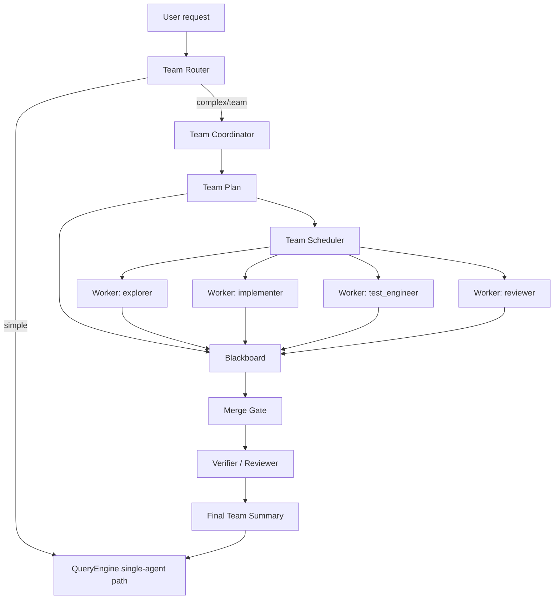
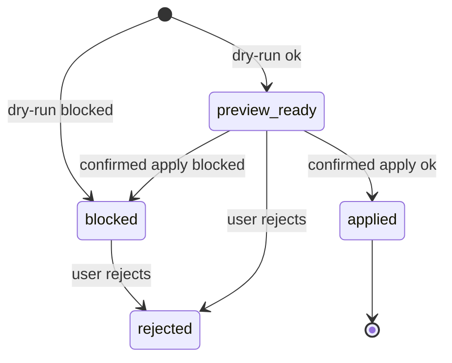

# Agent Team 多角色协同技术设计

## 1. 目标

Agent Team 的目标不是让多个模型“同时聊天”，而是在一个可控的 Coordinator 下，把复杂任务拆成多个有边界的 Worker 子任务，并通过 Blackboard、预算、文件锁、证据门控和最终汇总来保证可靠交付。

当前 CodeClaw 已有：

1. `Task` native tool：可派生单个 subagent。
2. `SubagentRegistry`：记录单个 subagent 的运行状态。
3. `Orchestration Planner / Executor / Reflector`：已有 goal/check/action/gap 基础结构。
4. `TurnGuard` / context budget / stuck guard：防止超长输出、空转和无限工具循环。
5. `CompletionGate` / evidence：要求完成声明必须有工具证据。
6. `audit` / `tasks` / `steps` / `observations` 存储基础。

Agent Team 要在这些基础上增加团队级协调层，而不是绕过现有权限、审计和稳定性机制。

## 2. 非目标

1. P0 不做企业级长期自治。
2. P0 不允许 Worker 无约束并发写同一文件。
3. P0 不做独立移动端或外部调度器。
4. P0 不让 Worker 绕过父会话的 permission mode、approval queue、context budget。
5. P0 不把 Team run 作为默认执行路径；只有明确复杂任务或用户选择 `/team` 时启用。

## 3. 总体架构



关键原则：

1. Coordinator 负责拆任务和预算，不直接做大量工具调用。
2. Worker 只处理一个清晰 scope，必须返回结构化 evidence。
3. Blackboard 是团队共享事实源，不是完整 transcript dump。
4. Merge Gate 只基于 Worker evidence、工具结果和测试结果宣称完成。
5. 所有 Worker 都受父 turn abort、provider circuit、context budget、approval queue 约束。

## 3.1 Claude Code 参考映射

本设计参考本地 Claude Code 源码快照的成熟机制，详细分析见 `docs/CLAUDE_CODE_REFERENCE_ANALYSIS.md`。参考重点不是照搬 tmux、remote、worktree 等复杂运行环境，而是吸收 Team 的治理协议：

| Claude Code 机制 | CodeClaw 映射 | P0 取舍 |
| --- | --- | --- |
| `AgentTool` / `runAgent` | `Task` subagent + `TeamWorkerRole` contract | 保留 role、allowed tools、timeout、status；暂不做 remote/worktree。 |
| `TeamFile` | `TeamRun` / `team_tasks` / `team_claims` | 用 SQLite 或内存 store 记录团队事实，不依赖 pane。 |
| `teammateMailbox` | `TeamMailbox` / Blackboard handoff | 只传短 handoff、risk、evidence，不传完整 transcript。 |
| `permissionSync` | Worker permission request -> parent approval queue | Worker 不直接提升权限，所有写入仍走父会话审批。 |
| `TaskCreate/Update/Get/Stop` | `/team status` / `/team cancel` / WorkerResult | Team 状态独立于最终模型总结，summary 为空也能本地 fallback。 |
| tool result storage | Worker output artifact 化 | 每个 worker 输出有字节上限，超限写 artifact，只入 Blackboard 摘要。 |
| read-only tool batching | Scheduler read-only 并发 | explorer/reviewer 可并发，implementer/writer 写操作受 claim 限制。 |

CodeClaw 额外保留自身差异：

1. Team 与现有 `TurnGuard`、`CompletionGate`、L1/L2/L3 记忆、Report/Dashboard、Beelink/DICOM MCP 统一，而不是另起一套 agent loop。
2. P0 不默认启用 Team；只有 `/team` 或 `task_needs_staging` 后用户确认才启用。
3. Web 是一等入口，需要 TeamRun 状态和阻塞原因可见，不能只在终端后台运行。

## 4. 模块划分

新增建议目录：

```text
src/agent/team/
  coordinator.ts
  scheduler.ts
  blackboard.ts
  mailbox.ts
  permissions.ts
  roles.ts
  claims.ts
  mergeGate.ts
  types.ts
  format.ts
```

后续可选存储：

```text
src/storage/repositories/teamRunRepo.ts
src/storage/repositories/teamBlackboardRepo.ts
```

## 5. 核心类型

```ts
export type TeamRunStatus =
  | "planning"
  | "running"
  | "waiting_approval"
  | "blocked"
  | "completed"
  | "failed"
  | "cancelled";

export type TeamWorkerRole =
  | "explorer"
  | "implementer"
  | "test_engineer"
  | "reviewer"
  | "writer";

export interface TeamRun {
  id: string;
  sessionId: string;
  userGoal: string;
  status: TeamRunStatus;
  createdAt: number;
  updatedAt: number;
  budget: TeamBudget;
  plan: TeamPlan;
}

export interface TeamBudget {
  maxWorkers: number;
  maxConcurrentWorkers: number;
  maxToolCallsPerWorker: number;
  maxDurationMsPerWorker: number;
  maxOutputBytesPerWorker: number;
  maxTotalDurationMs: number;
}

export interface TeamPlan {
  tasks: TeamTask[];
  mergeStrategy: "reviewer-gated" | "test-gated" | "manual-gated";
}

export interface TeamTask {
  id: string;
  role: TeamWorkerRole;
  objective: string;
  scope: TeamScope;
  deps: string[];
  allowedTools: string[];
  writePolicy: "read_only" | "claimed_files_only" | "approval_required";
  acceptance: string[];
}

export interface TeamScope {
  files?: string[];
  directories?: string[];
  symbols?: string[];
  maxFiles?: number;
}

export interface TeamClaim {
  id: string;
  teamRunId: string;
  taskId: string;
  path: string;
  mode: "read" | "write";
  status: "pending_approval" | "active" | "released" | "blocked";
  reason?: string;
  createdAt: number;
  releasedAt?: number;
}

export interface BlackboardEntry {
  id: string;
  taskId: string;
  kind: "fact" | "risk" | "decision" | "artifact" | "test_result" | "handoff";
  summary: string;
  evidenceRefs: EvidenceRef[];
  createdAt: number;
}

export interface TeamMailboxMessage {
  id: string;
  teamRunId: string;
  fromTaskId: string;
  toTaskId?: string;
  kind: "handoff" | "question" | "permission_request" | "permission_response";
  summary: string;
  text: string;
  evidenceRefs: EvidenceRef[];
  read: boolean;
  createdAt: number;
}

export interface TeamPermissionRequest {
  id: string;
  teamRunId: string;
  taskId: string;
  toolName: string;
  inputSummary: string;
  risk: "low" | "medium" | "high";
  status: "pending" | "approved" | "rejected";
  approvalId?: string;
  createdAt: number;
  resolvedAt?: number;
}

export interface EvidenceRef {
  type: "tool" | "artifact" | "file" | "test" | "approval";
  id?: string;
  path?: string;
  line?: number;
  status?: "passed" | "failed" | "blocked";
}

export interface WorkerResult {
  taskId: string;
  role: TeamWorkerRole;
  status: "completed" | "failed" | "blocked";
  summary: string;
  changedFiles: string[];
  evidence: EvidenceRef[];
  risks: string[];
  nextSteps: string[];
}
```

## 6. 角色设计

| Role | 目标 | 默认工具 | 写权限 |
| --- | --- | --- | --- |
| `explorer` | 快速定位文件、模块、风险区域 | read, glob, symbol, definition, references, knowledge_search | 无 |
| `implementer` | 在已 claim 的文件中实现改动 | read, replace, append, bash | claimed files only |
| `test_engineer` | 设计并运行验证 | read, bash, glob | 默认无写；补测试需 approval |
| `reviewer` | 审查实现与证据 | read, glob, references, bash | 无 |
| `writer` | 写文档、总结、迁移说明 | read, append, replace | claimed files only |

角色约束：

1. Worker prompt 必须包含 `scope`、`acceptance`、`forbidden actions`。
2. read-only role 必须强制 plan mode。
3. write role 只能改 claimed files；新增文件也必须先 claim。
4. Worker 不允许继续 spawn Task，避免树状递归失控。
5. TODO：支持 role/task 级模型配置，例如 `explorer` 使用快模型、`implementer` 使用强代码模型、`reviewer` 使用强审查模型；默认仍继承父会话模型，避免配置漂移。

## 7. Team Router

Team Router 决定是否走 Agent Team。

触发条件：

1. 用户显式使用 `/team` 或“多角色/并行/团队协作”。
2. 任务包含明显多模块工作：例如“全仓审查并修复”“实现功能并补测试和文档”。
3. 单 agent 路径被 `task_needs_staging` 阻断，且用户要求继续。

不触发条件：

1. 单文件小改动。
2. 简单问答。
3. Provider 当前 circuit open 或 context budget 已超限。
4. 权限模式不允许对应写操作且用户没有授权。

## 8. Coordinator 工作流

1. 读取用户目标和当前 workspace 状态。
2. 生成 TeamPlan，不超过 `maxWorkers`。
3. 为每个 TeamTask 分配 role、scope、acceptance。
4. 创建 file claims。
5. Scheduler 按 deps 和并发上限执行 Worker。
6. Worker 结果写入 Blackboard。
7. Merge Gate 汇总证据并决定是否完成、补跑测试、请求用户确认或降级。

Coordinator 不直接允许“全仓每文件阅读全文”。如果目标过大，必须先创建 explorer 阶段，输出模块分组，再进入下一阶段。

## 9. Scheduler

Scheduler 负责执行控制：

1. 拓扑排序 TeamTask。
2. `maxConcurrentWorkers` 默认 2。
3. 同 provider circuit 下并发不得超过 provider limit。
4. 父 abortSignal 级联到所有 Worker。
5. 任一 Worker hit context/stuck/timeout，只标记该 task blocked，不拖垮整个 TeamRun。
6. 如果关键 deps failed，后续依赖 task 标记 blocked。

默认预算建议：

| 项 | 默认值 |
| --- | --- |
| maxWorkers | 5 |
| maxConcurrentWorkers | 2 |
| maxToolCallsPerWorker | 12 |
| maxDurationMsPerWorker | 5 min |
| maxOutputBytesPerWorker | 24 KB |
| maxTotalDurationMs | 20 min |

## 10. Blackboard

Blackboard 只保存“可复用事实”，不保存完整输出。

Entry 类型：

1. `fact`：定位到的结构事实，如“report store 在 src/reports/store.ts”。
2. `risk`：未解决风险。
3. `decision`：Coordinator 或用户已确认的决策。
4. `artifact`：工具产物路径。
5. `test_result`：测试命令与结果。
6. `handoff`：Worker 给下一角色的简短交接。

写入规则：

1. 每条 entry 必须有 summary。
2. 高置信结论必须有 evidenceRefs。
3. 单条 summary 控制在 500 字符内。
4. 同类事实去重，保留最新 evidence。

## 10.1 Team Mailbox

Mailbox 用于 Worker 之间和 Worker -> Coordinator 的短消息传递。它不是 transcript，也不是大段工具输出容器。

消息类型：

1. `handoff`：Worker 完成阶段后给后续 task 的交接。
2. `question`：Worker 需要 Coordinator 或用户决策。
3. `permission_request`：Worker 需要执行受限工具。
4. `permission_response`：Coordinator 将审批结果回传给 Worker。

规则：

1. 单条消息 `summary` 控制在 120 字符内，`text` 控制在 2 KB 内。
2. 大输出必须进入 artifact，并通过 `evidenceRefs` 引用。
3. Mailbox 写入必须有锁或事务，避免多 Worker 并发覆盖。
4. Coordinator 每轮只读取未读消息，并转成 Blackboard entry 或 approval request。
5. Worker 不读取其他 Worker 的完整上下文，只读取发给自己的 mailbox 和全局 Blackboard 摘要。

## 11. File Claim

File Claim 防止并发写冲突。

规则：

1. read claim 可并发。
2. write claim 独占。
3. 未 claim 的文件不能被 write role 修改。
4. claim 冲突时 Scheduler 重新排队或请求 Coordinator 重新拆分。
5. reviewer 不需要 write claim。

Claim 示例：

```json
{
  "taskId": "team-task-2",
  "path": "src/commands/doctor.ts",
  "mode": "write",
  "status": "active"
}
```

## 12. Merge Gate

Merge Gate 是 Agent Team 的完成门控。

完成条件：

1. 所有 required tasks 为 completed。
2. 所有 changedFiles 有 implementer evidence。
3. 至少一个 reviewer 或 verifier 检查通过。
4. 若涉及代码改动，必须有测试或明确说明未运行原因。
5. 存在 blocked/failed task 时，最终 summary 必须列出未完成项，不能宣称全部完成。

输出结构：

```text
Team Summary
- Goal:
- Completed:
- Changed files:
- Evidence:
- Tests:
- Open risks:
- Next steps:
```

## 13. API / Tool 设计

P0 建议新增 native tool：

```ts
TeamTask
```

输入：

```json
{
  "goal": "string",
  "mode": "plan_only | execute",
  "maxWorkers": 5,
  "maxConcurrentWorkers": 2
}
```

输出：

```json
{
  "teamRunId": "team-run-...",
  "status": "completed | blocked | failed",
  "summary": "...",
  "tasks": [],
  "blackboard": [],
  "artifacts": []
}
```

也可以先不开放 LLM tool，只做 slash command：

```text
/team plan <goal>
/team run <goal>
/team status [runId]
/team cancel <runId>
```

推荐顺序：先做 slash command，再决定是否开放 native tool 给 LLM。

## 14. Web UI 设计

Team Run 面板：

1. 左侧：Team runs 列表。
2. 顶部：goal、status、budget、duration。
3. 中间：DAG / task cards。
4. 右侧：Blackboard entries。
5. 底部：Merge summary、tests、open risks。

Task card 字段：

1. role。
2. status。
3. scope。
4. claimed files。
5. tool calls。
6. evidence count。
7. error / blocked reason。

## 15. 存储设计

P0 可以先内存运行，完成后写 summary 到当前 session transcript。

P1 建议持久化：

```sql
CREATE TABLE team_runs (
  team_run_id TEXT PRIMARY KEY,
  session_id TEXT NOT NULL,
  goal TEXT NOT NULL,
  status TEXT NOT NULL,
  plan_json TEXT NOT NULL,
  budget_json TEXT NOT NULL,
  created_at INTEGER NOT NULL,
  updated_at INTEGER NOT NULL
);

CREATE TABLE team_tasks (
  team_task_id TEXT PRIMARY KEY,
  team_run_id TEXT NOT NULL,
  role TEXT NOT NULL,
  objective TEXT NOT NULL,
  scope_json TEXT NOT NULL,
  deps_json TEXT,
  status TEXT NOT NULL,
  result_json TEXT,
  created_at INTEGER NOT NULL,
  updated_at INTEGER NOT NULL
);

CREATE TABLE team_blackboard (
  entry_id TEXT PRIMARY KEY,
  team_run_id TEXT NOT NULL,
  team_task_id TEXT,
  kind TEXT NOT NULL,
  summary TEXT NOT NULL,
  evidence_json TEXT NOT NULL,
  created_at INTEGER NOT NULL
);

CREATE TABLE team_claims (
  team_run_id TEXT NOT NULL,
  team_task_id TEXT NOT NULL,
  path TEXT NOT NULL,
  mode TEXT NOT NULL,
  status TEXT NOT NULL,
  created_at INTEGER NOT NULL,
  updated_at INTEGER NOT NULL,
  PRIMARY KEY(team_run_id, path, mode)
);
```

## 16. 权限与安全

1. Team Coordinator 不提升权限。
2. Worker permissionMode 不得高于父会话授权。
3. 写文件必须经过 claim 和 permission manager。
4. MCP 工具仍走原 MCP permission gate。
5. Mobile approval、Web approval、CLI approval 都必须落 audit。
6. Worker 输出进入 Web 前必须走 thinking strip 和 displaySafe。
7. Worker 需要审批时只创建 `TeamPermissionRequest`，由 Coordinator 转入父会话 approval queue。
8. 审批结果必须写回 Mailbox，Worker 不允许绕过父会话直接继续高风险工具。

## 17. 稳定性策略

1. 每个 Worker 有独立 timeout。
2. Worker 输出超过阈值写 artifact，只回传摘要。
3. 同一 role 连续失败达到阈值，TeamRun 降级为 blocked。
4. Provider circuit open 时暂停新 Worker，不继续打 provider。
5. context budget exceeded 时停止 TeamRun，提示新开 session 或 `/compact`。
6. Coordinator 汇总失败时使用本地 fallback，不再次调用模型刷屏。
7. Worker 的工具结果进入 per-worker budget；超过预算时持久化 artifact，并在 Blackboard 中只保存路径和摘要。
8. 如果 auto compact 或 worker summary 连续失败达到阈值，TeamRun 转 `blocked`，不继续重试 provider。

## 18. 测试计划

单元测试：

1. `team/coordinator.test.ts`：任务拆分和预算限制。
2. `team/claims.test.ts`：读写 claim 冲突。
3. `team/blackboard.test.ts`：entry 去重和 evidence 必填。
4. `team/scheduler.test.ts`：deps、并发、timeout、blocked propagation。
5. `team/mergeGate.test.ts`：完成声明证据门控。
6. `team/mailbox.test.ts`：并发写入、未读读取、消息长度限制。
7. `team/permissions.test.ts`：Worker permission request 转父 approval，拒绝后 Worker blocked。

集成测试：

1. `/team plan` 对复杂任务生成 3-5 个 task。
2. explorer + reviewer read-only run 不改文件。
3. implementer 修改 claimed file，reviewer 复核。
4. Worker timeout 不拖垮整个 run。
5. context budget exceeded 后 TeamRun blocked，不继续 provider call。
6. Worker 最终 summary 为空时，Coordinator 从 Blackboard 生成本地 fallback。

真实 smoke：

1. 小型代码审查：explorer + reviewer。
2. 小型功能开发：explorer + implementer + test_engineer + reviewer。
3. 文档任务：explorer + writer + reviewer。

## 19. 里程碑

### M1: Plan-only Team

1. `TeamPlan` 类型。
2. `/team plan <goal>`。
3. Coordinator 只生成计划，不执行 Worker。
4. Web/CLI 展示 plan。

### M2: Read-only Team Run

1. explorer / reviewer Worker。
2. Blackboard in-memory。
3. Merge Gate read-only summary。
4. deps / budget / timeout 测试。

### M3: Claimed-file Write Team

1. implementer / writer。
2. File claim。
3. Approval integration。
4. test_engineer 验证。

### M4: Persistent Team Run

1. SQLite tables。
2. Web Team panel。
3. replay / resume。
4. audit integration。

### M5: Enterprise Team

1. 多租户隔离。
2. role policy。
3. org-level budget。
4. centralized audit。

## 20. 推荐先做

建议第一轮只做 M1 + M2：

1. 风险低，不涉及写文件。
2. 能立即解决“复杂任务应该分阶段”的问题。
3. 可以复用现有 `Task` runner 和 `SubagentRegistry`。
4. 能为后续写入型 Team 打好 Blackboard 和 Merge Gate 基础。

## 21. 当前实现状态

### M1: Plan-only Team 已实现

已落地：

1. `src/agent/team/types.ts`：定义 `TeamPlan`、`TeamTask`、`TeamBudget`、`TeamScope`、`TeamWorkerRole`。
2. `src/agent/team/coordinator.ts`：本地规则型 Coordinator，可根据目标生成 bounded plan。
3. `/team plan <goal>`：通过 slash command 调用 `QueryEngine.runTeamCommand()`，仅输出计划，不启动 Worker，不写文件。
4. Oversized guard：全仓、所有文件、逐文件、完整扫描类目标会被拆成 read-only staged first pass。
5. 单元测试：覆盖 oversized staging、feature plan、输出格式、slash delegation。

M1 约束：

1. 不调用 provider。
2. 不 spawn subagent。
3. 不写文件。
4. 不创建持久化 TeamRun。

下一步进入 M2：

1. 增加 in-memory `TeamRunStore`。
2. 增加 `Blackboard` 和 `TeamMailbox`。
3. 支持 read-only `explorer` / `reviewer` Worker。
4. Worker summary 为空时由 Blackboard 生成本地 fallback。

### M2/M3-gate: Read-only Team Run + Claim Gate 已实现

已落地：

1. `src/agent/team/store.ts`：in-memory `TeamRunStore`，支持 save/get/latest/list。
2. `src/agent/team/blackboard.ts`：结构化 Blackboard，保存 fact/risk/decision/handoff 等短摘要和 evidence。
3. `src/agent/team/mailbox.ts`：短消息 Mailbox，支持 handoff/question/permission_request/permission_response 消息结构。
4. `src/agent/team/runner.ts`：支持本地 read-only fallback runner，也支持注入真实 read-only worker。
5. `/team run <goal>`：生成计划并执行 read-only Team run；`explorer` / `reviewer` 通过现有 `Task` 工具接入受控 subagent，不写文件。
6. `/team status [runId]`：查看最近或指定 TeamRun 的本地状态、Claims、Blackboard 和 fallback summary。
7. QueryEngine 注入 `Task` 工具作为 Worker executor：`explorer -> Explore`，`reviewer -> code-reviewer`。
8. Worker 成功或失败都会写入 Blackboard；失败/空结果会降级为 risk 和本地 fallback summary，而不是依赖最终 provider 总结。
9. Team 专属 read-only allowed-tools 守门：`explorer` / `reviewer` 只允许 `read`、`glob`、`symbol`、`definition`、`references`。
10. `src/storage/repositories/teamRunRepo.ts` + `004_team_runs.sql`：TeamRun snapshot 持久化到 data.db。
11. `src/agent/team/claims.ts` + `005_team_claims.sql`：写入型 worker 先声明 claimed files，冲突或未授权时 blocked。
12. `/team approve <claimId>` / `/team deny <claimId>`：支持父会话显式批准或拒绝 claimed-file gate；该动作只更新 TeamRun claim 状态，不执行写入。
13. `/team cancel <runId>`：允许父会话取消等待/阻塞中的 TeamRun，并释放 pending/active claims。
14. 含 `pending_approval` claim 的 TeamRun 状态为 `waiting_approval`，Web/CLI 能直接看出当前阻塞在授权阶段。
15. `src/agent/team/mergeGate.ts`：Merge Gate 根据 `mergeStrategy` 要求 reviewer/test evidence，未满足时 TeamRun 不能进入 `completed`。
16. Web API：`GET /v1/web/sessions/<id>/team-runs` 返回当前 session 的 TeamRun 列表。
17. Web API：`POST /v1/web/sessions/<id>/team-runs/<runId>/cancel` 复用 QueryEngine cancel 逻辑，取消后返回更新后的 TeamRun snapshot。
18. Web API：`POST /v1/web/sessions/<id>/team-runs/<runId>/retry` 仅允许 read-only TeamRun 安全重跑，拒绝含写入/审批任务的 TeamRun。
19. Web React：新增 `Team` 面板展示 TeamRun、Task、Claims、Merge Gate、Blackboard、Mailbox，并支持可取消状态的取消按钮和 read-only 重跑按钮。
20. `src/agent/team/writeGuard.ts`：claimed-file-only 写入硬护栏，解析 `/write`、`/append`、`/replace` 目标并要求目标文件存在 active write claim；`/bash`、pending claim、未 claim 文件和 workspace 外路径全部拒绝。
21. `src/agent/team/writeExecutor.ts`：claimed-file write 执行器；先调用 Write Guard，通过后才复用现有 `runLocalTool` 执行 `/write`、`/append`、`/replace`，因此仍继承本地工具的备份、索引失效和错误处理。
22. `/team write <claimId> </write|/append|/replace ...>`：父会话批准 claim 后的受控写入口；它只传入当前 claim 给 Write Executor，确保一个 claim 只能修改自己的文件。
23. Web Team 面板支持 active write claim 输入 `/write`、`/append`、`/replace`，先调用 dry-run preview 展示 before/after，再要求用户二次确认后触发后端受控写 endpoint；前端只提供显式入口，最终安全判断仍在 QueryEngine + Write Executor。
24. `POST /team-runs/<runId>/write-preview` 只读不落盘；`POST /team-runs/<runId>/write` 要求 `confirmed=true`，防止旧 UI 或误调用绕过确认。
25. 单元测试覆盖本地 runner、注入 worker、worker blocked 传播、SQLite 持久化、claim 持久化、claim approve/cancel/write、Merge Gate、write guard、write executor、Web endpoint、slash delegation，以及 `/team run` / `/team retry` 经由 `Task` 工具的真实路径。

M2 当前边界：

1. 只允许 read-only `explorer` / `reviewer` 自动执行；`implementer`、`writer`、`test_engineer` 暂不执行，统一 blocked。
2. `Task` 子代理仍受现有 provider、permission mode、context budget、subagent guard 约束；Team 不绕过父会话治理。
3. TeamRun 已写入 SQLite snapshot；Web 当前按 session 查询，后续可扩展跨 session/replay 搜索。
4. Mailbox 已有结构并展示 handoff，但还没有真实 worker 轮询。
5. 写入型 worker 会生成 `pending_approval` claim 并让 TeamRun 进入 `waiting_approval`；批准 claim 后仍不直接写入，只允许进入 proposal/preview/apply 流程。
6. Merge Gate 已启用：`reviewer-gated` 要求 reviewer passed evidence；`test-gated` 要求 test_engineer + reviewer passed evidence。
7. Write Guard、Write Executor、CLI/Web 受控写入口、dry-run preview、二次确认和 provider write-worker proposal 生成已实现：active claim 是所有写入的硬前置条件。

下一步进入 M3-write：

1. 后续增强自动 write-worker 编排：把 provider write-worker proposal 从显式 `/team propose <claimId>` 扩展到更完整的 Coordinator 调度。
2. 继续增强 role/task 级模型配置：当前已支持同 provider 下通过 `--model role=model` 为 Team task 指定模型；跨 provider 选择、模型健康检查和 Web 配置仍留后续。

## 22. M3-write 自动编排设计

### 22.1 设计目标

M3-write 的目标不是“让模型自动改代码”，而是把写入型 worker 的输出收敛为可审查、可预览、可确认的结构化提案。

核心原则：

1. Worker 可以生成写入提案，但不能直接写文件。
2. 所有真实写入仍必须经过 `executeClaimedFileWrite()`。
3. 所有 Web 发起的真实写入仍必须先经过 dry-run preview 和 `confirmed=true`。
4. 自动编排只负责推进状态和收集证据，不绕过 claim、permission、context budget、Merge Gate。
5. 没有 reviewer/test evidence 时，TeamRun 不能进入真正完成态。

### 22.2 当前新增：role-level model override

已落地的最小闭环：

1. `TeamTask.model`：每个 task 可携带可选模型偏好。
2. `TeamPlanOptions.roleModels`：Coordinator 可按 role 注入模型，例如 explorer 用快模型、reviewer 用强审查模型。
3. `/team plan/run --model <role>=<model> <goal>`：CLI/Web Chat 可直接生成带模型偏好的 TeamPlan。
4. `Task` native tool 新增可选 `model` 参数；subagent 创建时会在当前 provider 上覆盖 request model。
5. 默认仍是 `inherit-parent`，没有显式配置时不改变现有 provider selection、fallback、permission、context budget。

当前边界：

1. 只支持“同 provider 不同 model id”，不负责跨 provider 路由。
2. 不做模型可用性探测；如果模型不存在，沿用现有 provider error/fallback/circuit breaker。
3. Web Team 面板暂只展示 plan/task snapshot 中的模型字段，后续再加 UI 配置入口。

### 22.2.1 TODO：cross-provider role routing

目标：允许不同 Team role 使用不同 provider instance，而不是只在当前 provider 下切 model id。

建议命令形态：

```bash
/team run \
  --agent explorer=lmstudio:qwen/qwen3.6-14b \
  --agent reviewer=ollama:qwen3:32b \
  审查 src/agent/queryEngine.ts
```

实现任务：

1. 新增 `TeamTask.providerRef` 或 `TeamTask.providerInstanceId`，与 `model` 分开记录。
2. `parseTeamGoalArgs` 增加 `--agent role=provider:model`，保留现有 `--model role=model` 兼容。
3. 从 runtime provider registry / selection 中解析 provider ref；找不到时在 plan 阶段明确报错，不等到 worker 执行才失败。
4. `Task` / `runSubagent` 支持按 task provider override 创建子 QueryEngine。
5. `/team plan`、`/team status`、Web Team 面板展示 `provider/model`，避免用户误以为所有 role 都走同一个模型。
6. 增加健康检查与 fallback 策略：role provider unavailable 时可选择 blocked、fallback parent provider 或请求用户决策。

验收：

1. 未配置 provider 时，`--agent` 返回清晰错误，不触发 provider 请求。
2. `--model` 仍只覆盖当前 provider 的 model，向后兼容。
3. `--agent` 能让 explorer/reviewer 分别使用不同 provider 请求。
4. Web Team snapshot 能看到每个 task 的 provider 与 model。
5. provider 失败仍走现有 circuit breaker / fallback / local fallback，不绕过 runtime guards。

### 22.3 状态机

写入型 task 的状态拆成两层：

1. `TeamTaskRun.status`：仍保留 `pending`、`running`、`completed`、`blocked`、`failed`。
2. `WriteProposal.status`：专门描述写入提案和确认过程。

当前实现的 `WriteProposal.status`：

| 状态 | 含义 | 允许动作 |
| --- | --- | --- |
| `preview_ready` | dry-run preview 通过，已有 before/after 摘要 | confirm/write |
| `blocked` | preview 或 execute 被 guard/工具挡住 | regenerate / reject |
| `applied` | 写入成功，claim released，task 可进入 completed | verify/review |
| `rejected` | 用户拒绝该 proposal | regenerate / cancel |

状态流：



### 22.3 WriteProposal 数据模型

建议新增类型：

```ts
export type TeamWriteProposalStatus =
  | "preview_ready"
  | "blocked"
  | "applied"
  | "rejected";

export interface TeamWriteProposal {
  id: string;
  teamRunId: string;
  taskId: string;
  claimId: string;
  path: string;
  prompt: string;
  risk: string;
  rollbackHint: string;
  status: TeamWriteProposalStatus;
  preview: TeamWriteProposalPreview;
  createdAt: number;
  updatedAt: number;
  appliedAt?: number;
  rejectedAt?: number;
}
```

存储策略：

1. M3 初期可先放进 `TeamRun` snapshot：`writeProposals: TeamWriteProposal[]`。
2. 已新增 SQLite `team_write_proposals` 表，用于跨 session replay 和审计索引；完整回放仍以 `team_runs.run_json` 为准。
3. 每个 proposal 必须绑定 `claimId`，不能只绑定 path。
4. 同一 active claim 可以有多个 proposal；后续独立队列表会保证同一时刻只有一个 apply 执行。

### 22.4 Worker 输出协议

写入型 worker 的返回不应是自由文本，而是结构化提案：

```json
{
  "claimId": "team-run-x:team-task-2:src/foo.ts",
  "prompt": "/replace src/foo.ts :: old :: new",
  "risk": "claimed-file-only write",
  "rollbackHint": "Review backup/diff for src/foo.ts before further changes"
}
```

约束：

1. `prompt` 只允许 `/write`、`/append`、`/replace`。
2. `prompt` 目标必须等于 claim path。
3. worker 不能调用 `runLocalTool()`。
4. worker 不能生成 `/bash` 写入。
5. worker 不能修改没有 active claim 的文件。
6. worker 输出过大或非 JSON 时，写 proposal 直接进入 `blocked`，并写入 Blackboard risk。

### 22.5 编排流程

第一版 M3-write 推荐流程：

1. `/team run <goal>` 创建 write task 和 pending claim。
2. 用户 `/team approve <claimId>` 或 Web approve，使 claim 变为 active。
3. Team Coordinator 或 LLM 使用 `/team propose <claimId>` 自动生成 guarded prompt，或使用 `/team propose <claimId> <guarded-write-prompt>` 走手动提案路径。
4. 系统对 proposal 自动执行 dry-run preview，但不写文件。
5. Web/CLI 展示 preview。
6. 用户确认后调用 `/team apply <proposalId>` 或 Web proposal apply。
7. 写入成功后 proposal 变为 `applied`，claim 变为 `released`，taskRun 变为 `completed`。
8. test_engineer/reviewer 继续补证据。
9. Merge Gate 通过后 TeamRun 才能 `completed`。

### 22.6 Web/CLI 行为

CLI：

1. `/team propose <claimId> [</write|/append|/replace ...>]`：不带 prompt 时调用 provider write-worker 生成 JSON guarded prompt；带 prompt 时走手动提案。两者都会立即 dry-run preview，不写文件。
2. `/team apply <proposalId>`：应用 preview_ready proposal，仍走 `executeClaimedFileWrite()`。
3. `/team write <claimId> <prompt>`：保留当前手动路径。
4. Web 提供 proposal apply/reject；CLI reject 后续可补。

Web：

1. Claims 区继续显示手动 prompt 输入。
2. 新增 Write Proposals 区，展示 prompt、risk、rollback hint、preview。
3. 用户可 apply/reject proposal；apply 需要后端 `confirmed=true`。
4. 后续增强：用户可编辑 proposal prompt；编辑后重新 preview。

### 22.7 安全边界

必须保持以下不变量：

1. 自动 worker 不直接写文件。
2. `executeClaimedFileWrite()` 是唯一真实写文件路径。
3. Web write endpoint 必须要求 `confirmed=true`。
4. preview 和 execute 必须共享 `parseTeamWritePrompt()` 和 `enforceClaimedFileWrite()`。
5. proposal 的 `claimId`、`taskId`、`target path` 必须三者一致。
6. claim released 后不能再执行旧 proposal。
7. failed/blocked proposal 不释放 claim，允许用户编辑后重试。
8. applied proposal 必须写 Blackboard artifact 和 evidence。

### 22.8 测试计划

P0 测试：

1. write worker 生成 proposal，但文件不变。
2. proposal prompt 指向未 claim 文件时 preview blocked。
3. proposal prompt 使用 `/bash` 时 preview blocked。
4. active claim + valid proposal 能 preview_ready。
5. preview_ready proposal 通过 `executeClaimedFileWrite()` 后 applied，claim released。
6. prompt 修改必须创建新 proposal，不能复用旧 preview 确认。
7. Merge Gate 不因 proposal applied 自动通过；仍要求 reviewer/test evidence。

P1 测试：

1. proposal SQLite 持久化和恢复。
2. Web proposal 展示和编辑。
3. rejected proposal 不影响 claim。
4. 多 proposal 竞争同一 claim 时，只允许一个 apply 执行。

### 22.9 开发任务

建议按以下顺序开发：

1. 已完成：`types.ts` 增加 `TeamWriteProposal` 类型，`TeamRun` 增加 `writeProposals`。
2. 已完成：QueryEngine 增加 `/team propose` 和 `/team apply`，proposal 创建时复用 claimed-file preview。
3. 已完成：Web Team 面板增加 Write Proposals 展示、apply、reject。
4. 已完成：TeamRun snapshot 持久化 proposal 历史，旧 snapshot 读取时自动补 `writeProposals: []`。
5. 已完成：抽出 `src/agent/team/writeProposal.ts`，集中 proposal 创建、拒绝和 apply 队列。
6. 已完成：`TeamWriteApplyQueue` 保证同一 TeamRun 同时只有一个 proposal apply。
7. 已完成：SQLite 增加 proposal 独立表 `team_write_proposals`，并提供 `TeamRunRepo.listWriteProposals()` 查询入口。
8. 已完成：`/team propose <claimId>` 不带 prompt 时会调用 provider write-worker 自动生成 guarded prompt；provider 输出仍必须经过 proposal dry-run preview。
9. 后续：把 provider write-worker proposal 从显式命令扩展到更完整的 Coordinator 调度。
