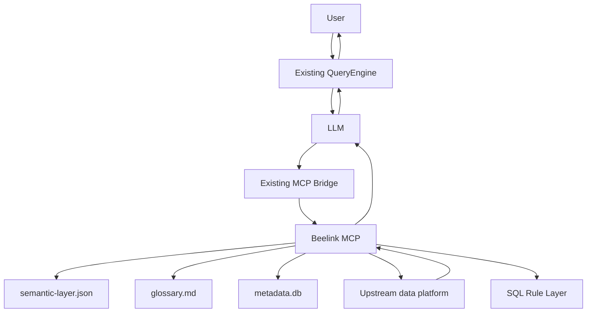
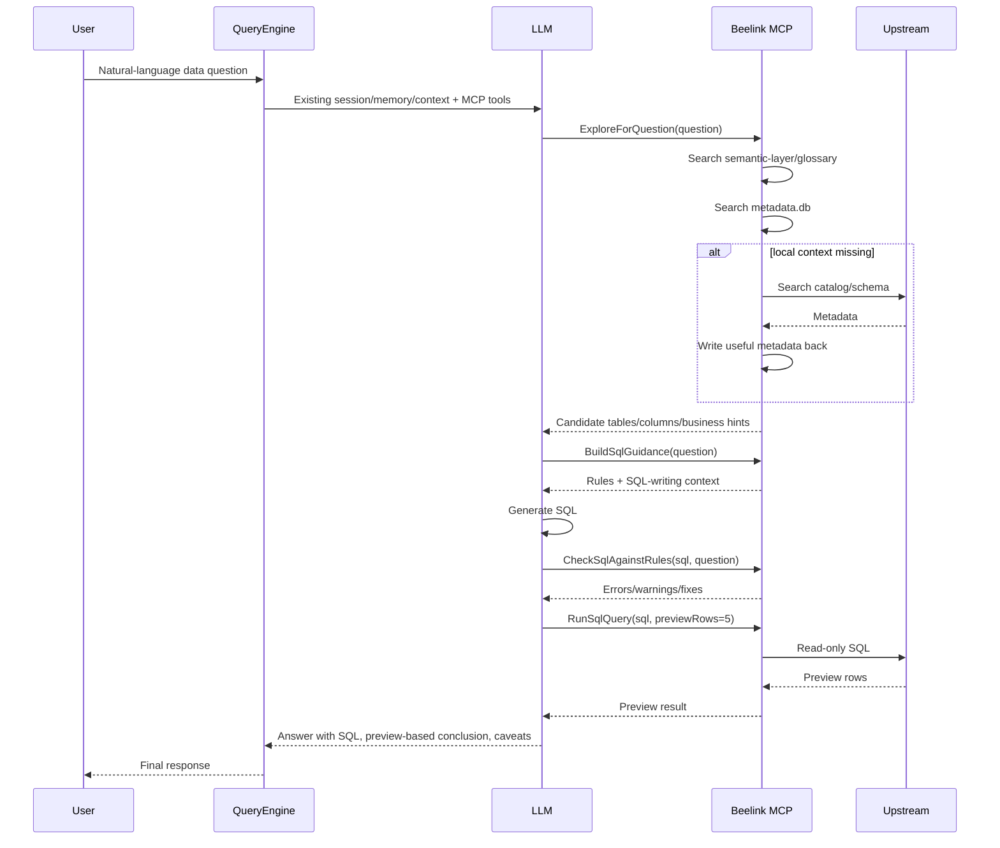

# Beelink Data Analysis Design

## 1. Goal

Beelink adds a data-analysis lane to CodeClaw without creating a second QueryEngine, a `/data` mode, or a SQL planner that competes with the LLM.

The target flow is:

1. User asks a business/data question in normal CodeClaw.
2. CodeClaw's existing QueryEngine provides session, memory, compacted context, and MCP tool-use.
3. Beelink MCP provides semantic context, metadata context, SQL guardrails, and read-only execution.
4. The LLM remains responsible for reasoning and SQL generation.
5. Beelink checks obvious SQL issues before execution and returns bounded preview results.

## 2. Non-Goals

- Do not add `/data on` or a separate data interaction mode.
- Do not route ordinary user messages directly to beelink.
- Do not add `PlanSqlQuery` as a separate planning layer.
- Do not store data metadata in CodeClaw's global `data.db`.
- Do not let chart/report tools connect to the upstream database directly.
- Do not return unbounded query results into the LLM context.

## 3. Functional Design

### 3.1 User-Facing Capabilities

Beelink should support these tasks:

- Discover available catalog objects.
- Sync catalog/table/column metadata into a local project index.
- Search local metadata before probing upstream.
- Read a local semantic layer that maps business terms to tables, fields, and metric rules.
- Build SQL guidance for a natural-language question.
- Check generated SQL against rules before execution.
- Execute read-only SQL and return a small preview.
- Let the LLM summarize the preview with uncertainty and caveats.

### 3.2 Desired User Flow

For a question like:

```text
分析食物表里面什么东西最畅销
```

The ideal LLM/tool sequence is:

```text
ExploreForQuestion
-> BuildSqlGuidance
-> LLM writes SQL
-> CheckSqlAgainstRules
-> PrepareSqlReference if needed
-> RunSqlQuery
-> LLM summarizes preview
```

`BuildSqlGuidance` and `CheckSqlAgainstRules` are rule/context helpers, not planners.

### 3.3 Current Implemented Tools

The current beelink MCP server already exposes:

- `ListCatalogEntries`
- `GetSchemaOfTable`
- `GetDescriptionOfTableOrSchema`
- `GetTableOrViewLineage`
- `PrepareSqlReference`
- `SyncMetadataIndex`
- `InitSemanticLayer`
- `SearchMetadataIndex`
- `RunSemanticSearch`
- `ExploreForQuestion`
- `GetUsefulSystemTableNames`
- `BuildSqlGuidance`
- `CheckSqlAgainstRules`
- `RepairSqlAttempt`
- `RunSqlQuery`
- `ExportSqlArtifact`

### 3.4 Future Tools

Optional future tools:

- `PrepareChartRenderArgs`
- `ExplainQueryPreview`

## 4. Architecture



Key boundary:

- QueryEngine owns orchestration.
- LLM owns reasoning and SQL generation.
- Beelink owns metadata, semantic context, rule checks, SQL reference repair, and read-only execution.

## 5. Storage Design

Beelink stores project-level data metadata under:

```text
~/.codeclaw/projects/<workspace-hash>/beelink/
  metadata.db
  semantic-layer.json
  glossary.md
```

`SyncMetadataIndex` creates draft semantic files when they are missing. Existing files are never overwritten. These draft files are intended to be reviewed by a human or later ingested into CodeClaw's main knowledge base when that flow is available.

Environment overrides:

- `BEELINK_METADATA_DB`
- `BEELINK_SEMANTIC_LAYER`
- `BEELINK_GLOSSARY`

### 5.1 metadata.db

`catalog_objects`

```text
path TEXT PRIMARY KEY
name TEXT NOT NULL
type TEXT NOT NULL
parent_path TEXT
last_synced_at INTEGER NOT NULL
permission_status TEXT NOT NULL
```

`table_columns`

```text
object_path TEXT NOT NULL
column_name TEXT NOT NULL
data_type TEXT NOT NULL
nullable INTEGER
ordinal INTEGER NOT NULL
description TEXT
business_name TEXT
sample_values_json TEXT
header_confidence REAL
semantic_tags TEXT
last_synced_at INTEGER NOT NULL
PRIMARY KEY (object_path, column_name)
```

Some upstream tables expose physical columns such as `A-K` while the first data row contains real business headers. During metadata sync, Beelink samples the first rows and, when the first row looks like headers, records mappings such as:

```text
A -> Customer_id
E -> items
F -> amount
```

These hints are searchable through `SearchMetadataIndex` and are included in guidance output.

### 5.2 semantic-layer.json

Human-maintained semantic rules:

```json
{
  "metrics": [
    {
      "name": "最畅销商品",
      "aliases": ["卖得最好", "销量最高"],
      "table": "@x.food_daily",
      "dimensions": ["food_name"],
      "measures": [{ "name": "销量", "expression": "SUM(quantity)" }],
      "defaultOrderBy": "SUM(quantity) DESC"
    }
  ],
  "entities": [
    {
      "name": "食物",
      "aliases": ["菜品", "食品"],
      "candidateTables": ["@x.food_daily"]
    }
  ]
}
```

### 5.3 glossary.md

Human-readable business notes:

```markdown
# 食物分析

- 食物、菜品、商品通常指 `@x.food_daily`。
- 最畅销优先按销量口径统计；如果没有销量字段，再检查订单量或销售额字段。
```

## 6. End-to-End Flow



## 7. SQL Rule Layer

The rule layer does not generate SQL. It only builds guidance and checks obvious issues.

### 7.1 BuildSqlGuidance

Input:

```json
{
  "question": "分析食物表里面什么东西最畅销",
  "limit": 10,
  "probeIfEmpty": true
}
```

Output:

```text
SQL guidance

Question:
分析食物表里面什么东西最畅销

Semantic matches:
- Metric: 最畅销商品
- Table: @x.food_daily
- Dimensions: food_name
- Measures: SUM(quantity)
- Default order: SUM(quantity) DESC

Metadata candidates:
- @x.food_daily [table]
- column food_name VARCHAR
- column quantity BIGINT

Rules:
- Use read-only SQL only.
- Quote @x as "@x".
- Use only known columns unless you first inspect schema.
- Add LIMIT for preview.
- If using aggregation, put non-aggregated dimensions in GROUP BY.
- If fields are ambiguous, ask for schema/probe instead of inventing columns.
```

### 7.2 CheckSqlAgainstRules

Input:

```json
{
  "question": "分析食物表里面什么东西最畅销",
  "sql": "select food_name, sum(quantity) from @x.food_daily order by sum(quantity) desc"
}
```

Output:

```text
SQL rule check

errors:
- none

warnings:
- @x.food_daily should be quoted as "@x".food_daily
- aggregation query has non-aggregated column food_name; ensure GROUP BY food_name
- no LIMIT found; add LIMIT 5 for preview

suggested fixes:
- Use FROM "@x".food_daily
- Add GROUP BY food_name
- Add LIMIT 5
```

## 8. Tool Responsibilities

### ListCatalogEntries

Lists upstream catalog objects under a path. It is a direct upstream probe.

### GetSchemaOfTable

Reads upstream schema for a table/view. It is used when local metadata is missing or stale.

### SyncMetadataIndex

Pulls upstream catalog/schema metadata into local `metadata.db`.

### SearchMetadataIndex

Searches local `metadata.db`. This should be preferred before live upstream probing.

### ExploreForQuestion

Combines:

- semantic-layer matches
- glossary excerpt
- local metadata search
- optional upstream probe if local context is empty

It returns context, not SQL.

### BuildSqlGuidance

Builds SQL-writing instructions from `ExploreForQuestion` output and the rule layer.

It returns guidance, not SQL.

### CheckSqlAgainstRules

Checks a generated SQL string for:

- unsafe statement type
- multiple statements
- unquoted special catalog paths
- missing preview limit
- likely aggregation/group-by mismatch
- unknown table/field references when metadata is available

It returns warnings/errors, not execution results.

### RepairSqlAttempt

Classifies a failed SQL attempt and gives repair guidance.

It handles:

- `sql_reference`: bad catalog quoting such as `@x.food_daily`
- `metadata_missing`: missing table/column/schema
- `aggregation`: grouping and aggregate mistakes
- `permission`: insufficient upstream privileges
- `timeout`: queries too broad for preview
- `syntax`: parser errors
- `safety`: non-read-only SQL
- `unknown`: fallback category

When `question` is supplied and the failure is metadata-related, permission-related, or unknown, it may call `ExploreForQuestion` to supplement semantic and metadata context. It does not execute SQL.

### PrepareSqlReference

Quotes a catalog path or path segment safely.

### RunSqlQuery

Executes one read-only SQL statement and returns bounded preview rows.

## 9. Failure Handling

### Missing Local Metadata

Flow:

```text
SearchMetadataIndex returns empty
-> ExploreForQuestion probes upstream if allowed
-> Useful probe results are written back to metadata.db
-> LLM receives updated context
```

### SQL Rule Check Fails

Flow:

```text
CheckSqlAgainstRules returns errors
-> LLM revises SQL
-> Check again or run after correction
```

### SQL Execution Fails

Flow:

```text
RunSqlQuery returns error
-> LLM classifies error
-> use PrepareSqlReference / GetSchemaOfTable / SearchMetadataIndex
-> revise SQL
-> retry once
```

### SQL Succeeds But User Says Result Is Wrong

This is semantic feedback, not a system failure.

Flow:

```text
User says result is wrong
-> LLM asks what business rule/field is incorrect, or infers from correction
-> update semantic-layer.json manually or through a future controlled tool
-> rerun ExploreForQuestion
-> regenerate SQL with corrected semantics
```

Do not silently overwrite semantic rules from arbitrary user feedback in P2.

## 10. Security and Safety

- Only read-only SQL should execute.
- Multiple SQL statements are blocked.
- SQL preview rows default to 5.
- Result export and chart generation must use artifacts, not raw large context.
- Passwords stay in MCP environment config, not in repo docs or metadata DB.
- Metadata DB stores schema and semantic hints, not query result data.

## 11. Development Plan

### Done

- Standard beelink MCP server.
- Password-based upstream connection.
- Catalog listing.
- Schema loading.
- Read-only SQL execution.
- SQL reference quoting.
- Project-level `metadata.db`.
- `SyncMetadataIndex`.
- `InitSemanticLayer`.
- `SearchMetadataIndex`.
- `semantic-layer.json` and `glossary.md` readers.
- `ExploreForQuestion`.
- `BuildSqlGuidance`.
- `CheckSqlAgainstRules`.
- `RepairSqlAttempt`.
- `RunSemanticSearch`.
- `GetDescriptionOfTableOrSchema`.
- `GetTableOrViewLineage`.
- `GetUsefulSystemTableNames`.
- `ExportSqlArtifact`.

### Next

1. Tune SQL rule warnings based on real failures.
2. Add optional unknown-column warnings after enough metadata samples.
3. Add metadata freshness/staleness checks in guidance and L3 evidence.
4. Add permission fallback notes per table/schema.
5. Add controlled semantic-layer editing workflow.

### Later

1. Add `PrepareChartRenderArgs`.
2. Add chart/report preparation helpers from exported SQL artifacts.
3. Add reviewed-vs-draft semantic-layer workflow.

## 12. Acceptance Criteria

P2 is acceptable when:

- `/mcp tools beelink` lists all beelink tools.
- `SyncMetadataIndex` can sync a known path.
- `SearchMetadataIndex` can find synced tables/columns.
- Header/sample inference can map physical columns such as `A-K` to business names like `items`.
- Missing `semantic-layer.json` and `glossary.md` are initialized as conservative drafts during metadata sync.
- `ExploreForQuestion` returns semantic + metadata context without generating SQL.
- `BuildSqlGuidance` returns clear SQL-writing rules.
- `CheckSqlAgainstRules` catches obvious SQL issues.
- `RunSqlQuery` executes only read-only SQL and returns bounded preview.
- A real question such as “分析食物表里面什么东西最畅销” can be answered through the chain without adding `/data` mode.

## 13. Main Knowledge Base Integration

Beelink now participates in CodeClaw's L3 Knowledge layer through local semantic
and metadata files. It still remains a standard MCP server and does not become a
second QueryEngine.

See also: `docs/L3_KNOWLEDGE_TECH_DESIGN.md`.

Beelink owns the data-domain source files:

- `metadata.db`: synchronized catalog, schema, and inferred header hints.
- `semantic-layer.json`: conservative metric/entity draft generated from metadata.
- `glossary.md`: human-readable business vocabulary and column mapping draft.

CodeClaw reads these files through `knowledge_search mode=beelink` or
`sources=["beelink"]` when local data-domain evidence is useful.

### 13.1 Ownership Boundary

- Beelink generates and refreshes data-domain metadata artifacts via `SyncMetadataIndex`.
- Beelink does not decide whether a normal user message is a data question.
- QueryEngine owns memory, context compression, tool choice, LLM prompting, and final answers.
- L3 Knowledge owns local retrieval and provenance packaging across RAG, Graph, and Beelink sources.
- Beelink MCP live tools own metadata sync, SQL guidance/rules, repair hints, and read-only SQL execution.

### 13.2 Current Ingestion Contract

`knowledge_search` reads:

- `semantic-layer.json` as structured metrics, entities, aliases, candidate tables, dimensions, measures, and default order rules.
- `glossary.md` as unstructured business terminology and column-mapping notes.
- `metadata.db` table profiles as source-backed evidence for table paths, physical columns, business names, sample values, sync time, and permission state.

Retrieved evidence should preserve:

- source file path
- workspace hash or project identity
- upstream object path
- last synced timestamp
- semantic kind, metadata object, table path, or column name when available
- whether content is generated draft or human-reviewed when that flag exists

### 13.3 Retrieval Contract

When the main LLM needs SQL context, CodeClaw retrieves in this order:

1. Current conversation and L2 recall.
2. `knowledge_search mode=beelink` for local semantic and metadata evidence.
3. Beelink MCP `BuildSqlGuidance` when full SQL guidance is needed.
4. LLM writes SQL from the evidence and guidance.
5. Beelink MCP `CheckSqlAgainstRules` performs a lightweight rule check.
6. Beelink MCP `RunSqlQuery` executes read-only SQL and returns bounded preview.

Live upstream probing remains Beelink MCP responsibility and should be used only
when local context is empty, stale, or explicitly refreshed.

### 13.4 Acceptance Criteria

- Running `SyncMetadataIndex` can produce draft semantic files without overwriting reviewed files.
- `knowledge_search mode=beelink` returns semantic, glossary, object, and column hits from local files without executing SQL.
- Normal non-data conversations do not call Beelink unless the LLM chooses relevant evidence.
- SQL generation prompts receive both existing CodeClaw context and retrieved data-domain knowledge.
- Each retrieved semantic fact can be traced back to metadata sync output or a reviewed semantic file.
- Live SQL remains behind `RunSqlQuery`.
