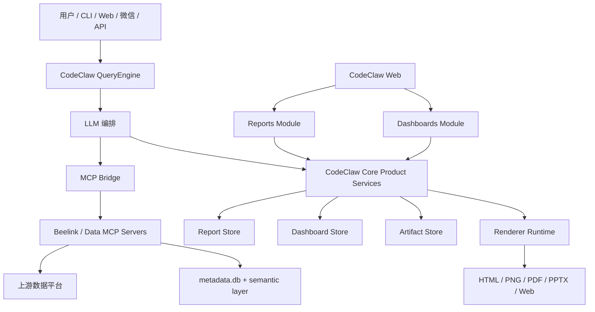

# CodeClaw 企业级 AI/BI Reports & Dashboards 功能详细设计

## 1. 目标

CodeClaw 要演进为企业级 AI/BI 平台，而不是只做一个轻量图表渲染器。

Dashboard 能力应当对齐 Databricks AI/BI Dashboards 的主要产品能力，并叠加 CodeClaw 自有优势：

- MCP-native 多源数据接入。
- 支持本地、私有化、云端大模型。
- 支持 CLI、Web、微信、API 多渠道交互。
- SQL、工具链、模型推理过程可审计。
- Artifact-first 结果处理，避免大结果刷爆终端，也便于合规留痕。
- 可插拔语义层，覆盖 Dremio、Databricks、文件、SQL 引擎和未来 MCP 数据源。

目标不是一次性做完所有能力，而是按企业级产品路径逐步交付。

### 1.1 本轮确认的设计结论

本轮设计明确三个关键边界：

- **Dashboard/Report 不是纯 MCP 功能**：MCP 负责数据和 AI 工具能力，CodeClaw Core/Web 负责产品能力。
- **Reports 和 Dashboards 要进入现有 CodeClaw Web**：Web 内嵌为主，独立 HTML/PDF/PPTX artifact 导出为辅。
- **Reports 和 Dashboards 是两类产品对象**：Report 解决一次性分析和汇报，Dashboard 解决长期监控、交互和治理。

具体分工：

- **MCP 层**：元数据探查、语义检索、SQL guidance、SQL rule check、只读 SQL 执行、结果 preview、artifact 导出、chart args 生成。
- **CodeClaw Core 层**：`ReportArtifact`、`DashboardSpec`、artifact store、权限、版本、发布、订阅、审计、生命周期。
- **CodeClaw Web 层**：Reports 列表/详情页、Dashboards 列表/详情页、Dashboard viewer/editor、筛选器、钻取、导出入口。
- **LLM 层**：通过 MCP 工具拿到数据和上下文，生成 SQL、图表建议、报告叙事、Dashboard 草案和质量评审。

一句话：**MCP 提供数据和工具能力，Reports/Dashboards 是 CodeClaw 的核心产品能力。**

## 2. 参考能力

Databricks AI/BI Dashboards 提供了这些核心产品概念：

- Data tab：可复用数据集。
- Canvas tab：可视化组件、文本、图片、表格、筛选器。
- 多页面 Dashboard 和报表。
- AI 辅助创建图表和 Dashboard。
- 全局、页面级、组件级筛选器。
- 参数。
- Cross-filtering，点击图表联动过滤其他组件。
- Drill-through，从汇总跳转到明细。
- 分享、发布、订阅、定时刷新。
- 通过 Unity Catalog 做数据治理和权限控制。
- Genie spaces，用自然语言探索 Dashboard 数据。

CodeClaw 应当逐步实现同类完整能力，同时保持数据源无关。企业版 CodeClaw 应把这些能力作为产品对齐目标，而不是可选灵感。

## 3. 能力对齐目标

| 领域 | 企业级 AI/BI 目标 | CodeClaw 实现方向 |
| --- | --- | --- |
| 数据集层 | 可复用 Dashboard 数据集 | `DashboardDataset` 基于 MCP 查询 artifact、语义指标和治理刷新策略 |
| 可视化编辑器 | Canvas、页面、组件 | Web 编辑器 + JSON-as-code 的 `DashboardSpec` |
| 可视化库 | 柱状图、折线图、面积图、饼图、散点图、组合图、地图、热力图、直方图、箱线图、漏斗图、仪表盘、透视表、表格、指标卡 | ECharts-first 渲染，后续支持可插拔渲染器 |
| AI 创作 | 自然语言创建 Dashboard 和图表 | QueryEngine + Beelink 语义工具 + 图表评审 + Dashboard spec 生成 |
| 筛选器 | 全局、页面级、组件级筛选 | `DashboardFilter`，先支持 artifact 客户端过滤，后续支持服务端刷新 |
| 参数 | 用户输入查询参数 | 参数模板必须校验，禁止原始字符串拼接 SQL |
| Cross-filter | 点击一个图表过滤其他组件 | `DashboardInteraction(type="cross_filter")` |
| Drill-through | 从汇总跳转到明细 | `DashboardInteraction(type="drill_through")`，带字段映射 |
| 预测和异常 | AI 辅助趋势预测和异常分析 | Forecast/anomaly widgets，必须记录模型、来源和风险提示 |
| Dashboard 问答 | 类 Genie 的 Dashboard Q&A | `AskDashboard` 基于 dashboard spec、artifact、语义层，并可按需实时刷新 |
| 发布和分享 | 共享 Dashboard | 企业存储，支持 ACL、生命周期、发布状态和不可变版本 |
| 定时和订阅 | 定时刷新和交付 | 基于 cron/automation 刷新，后续支持邮件、微信、Slack、API |
| 治理 | Catalog 权限、血缘、审计 | 上游权限透传、本地 ACL、审计日志、血缘、数据分类 |
| 导出 | Dashboard 和报表导出 | HTML、PNG、PDF、PPTX、JSON package |
| 可审计性 | 查询和访问日志 | SQL、query id、工具链、模型、prompt 摘要、artifact、评审动作 |

## 4. CodeClaw 企业版差异化能力

CodeClaw 不应该只是复制 Databricks。它要结合自己的架构形成独特能力：

- **MCP-native BI**：任何 MCP 数据服务都可以成为 Dashboard 数据源。
- **多模型编排**：SQL 生成、通用推理、图表评审、叙事生成、图片/语音通道可以使用不同模型。
- **Local-first 部署**：可以运行在个人电脑、私有服务器、企业内网。
- **多渠道 BI**：Dashboard 问答和报表可以通过 CLI、Web、微信和未来 API 流转。
- **透明推理链路**：每条 SQL、规则检查、元数据查询、结果 preview、图表 artifact 都可追踪。
- **语义反馈闭环**：用户纠错可以在审核后进入语义知识。
- **Artifact-first 可靠性**：大数据、报表、图表和 Dashboard 渲染结果落盘，而不是刷满对话上下文。
- **数据源中立**：Dremio、Databricks、Postgres、ClickHouse、SQLite、CSV、云数仓和未来 MCP connector 可以共用同一套 Dashboard 模型。
- **Agentic BI 运维**：定时刷新、异常检查、报告生成、主动告警可复用 CodeClaw automation 和 runtime guards。
- **DashboardSpec as code**：Dashboard 可以进入 Git，支持版本化、评审、diff、测试、晋级和回滚。
- **透明业务语义**：指标定义、术语表、别名、用户修正都是可评审的一等 artifact。
- **Human-in-the-loop 认证**：AI 可以提出图表、指标、语义映射，但企业认证必须人工批准。
- **Conversation-to-dashboard 血缘**：Dashboard 能解释每个组件来自哪个用户请求、元数据搜索、SQL 草稿、规则检查、查询结果和图表评审。
- **Channel-native 消费**：同一个 Dashboard 可以变成 CLI 摘要、网页、微信卡片、定时简报或 API payload。

## 5. 当前 CodeClaw 状态

已具备的基础能力：

- Beelink MCP 元数据、语义工具、SQL guidance、SQL rule check、只读 SQL preview。
- 本地 `metadata.db`、`semantic-layer.json`、`glossary.md`。
- wiki、label、lineage 的 best-effort 元数据增强。
- 大输出 artifact 存储。
- ECharts MCP 集成。
- 长输出、空转、provider fallback 的运行时保护。
- 覆盖 chart/report 行为的数据黄金测试。

当前缺口：

- 没有企业级 Dashboard specification。
- 没有可复用 Dashboard dataset 模型。
- 没有 widget/layout engine。
- 没有 Dashboard renderer/runtime。
- 没有 Dashboard-scoped Ask/Genie-like 体验。
- 没有 filter、parameter、cross-filter、drill-through runtime。
- 没有 publish/share/permission model。
- 没有 refresh/subscription/alerting model。
- 没有 Dashboard lifecycle/versioning/review flow。

## 6. 企业级范围

CodeClaw 最终应支持：

- 完整 Dashboard authoring。
- 多页面报表和 Dashboard 设计。
- 可复用、受治理的数据集。
- 丰富图表组件。
- 表格、指标卡、Markdown、图片、AI narrative widgets。
- 筛选器、参数、cross-filtering、drill-through。
- Dashboard Ask mode。
- 定时刷新和订阅。
- 导出 HTML、PNG、PDF、PPTX 和可分享 package。
- 权限和角色模型。
- 审计日志和血缘。
- 支持 workspace、project、team 隔离的企业部署。

企业级范围拆成两条主线：

- **创作链路**：创建、编辑、校验、渲染、评审、发布 Dashboard。
- **消费链路**：查看、问答、筛选、钻取、导出、订阅、审计 Dashboard。

两条链路必须使用同一套 `DashboardSpec`、dataset artifact、语义层和治理元数据。

### 6.1 Reports 和 Dashboards 的区别

| 项目 | Reports | Dashboards |
| --- | --- | --- |
| 核心定位 | 一次性分析结果，一份结论 | 长期可复用看板，一套可交互指标系统 |
| 触发方式 | 用户提出一个分析问题后生成 | 用户明确要看板，或从高价值 Report 升级 |
| 数据形态 | 查询结果、图表、解释、洞察、风险提示 | 固定数据集、指标、布局、筛选器、参数、交互 |
| 生命周期 | 生成、查看、导出、分享、归档 | 创建、编辑、发布、刷新、订阅、审计、版本管理 |
| 交互性 | 较弱，偏静态阅读 | 较强，支持筛选、联动、钻取、追问 |
| 刷新 | 默认不刷新，除非用户手动更新 | 支持手动、定时、事件触发刷新 |
| 权限 | 初期继承会话/项目权限 | 企业版需要 Dashboard ACL、发布权限、订阅权限 |
| 典型例子 | “分析这个月最畅销的商品” | “食品销售经营看板” |
| 数据资产 | `ReportArtifact` | `DashboardSpec` + `DashboardDataset` |

推荐用户路径：

```text
用户提问
-> CodeClaw 生成 ReportArtifact
-> 用户确认有长期价值
-> 一键升级为 DashboardSpec
-> 补充筛选器、参数、刷新策略、权限、订阅
-> 发布为长期 Dashboard
```

### 6.2 Web 产品入口

Reports 和 Dashboards 应嵌入现有 CodeClaw Web，而不是另做一个完全独立的 Web 应用。

推荐 Web 信息架构：

```text
CodeClaw Web
  ├─ Chat / Ask
  ├─ Data / Semantic
  ├─ Reports
  │   ├─ Report list
  │   ├─ Report detail
  │   ├─ Export
  │   └─ Upgrade to Dashboard
  └─ Dashboards
      ├─ Dashboard list
      ├─ Dashboard viewer
      ├─ Dashboard editor
      ├─ Publish / Share
      ├─ Schedule / Subscribe
      └─ Audit / Versions
```

保留独立 artifact 输出：

- Report 可导出为 Markdown、HTML、PDF、PPTX。
- Dashboard 可导出为 HTML、PNG、PDF、PPTX、JSON package。
- 微信、邮件、Slack 等渠道优先发送摘要卡片和 artifact 链接。

## 7. 架构



职责边界：

- QueryEngine 负责对话、记忆、审批、运行时保护和 MCP 工具访问。
- Beelink/data MCP 负责数据元数据、语义上下文、SQL 执行和结果 preview。
- Dashboard services 负责数据集、组件、布局、渲染、版本、订阅和 Dashboard-scoped Ask。
- 上游数据平台仍然是数据权限的最终权威。

### 7.1 MCP 层和产品层边界

Dashboard/Report 能力不应全部塞进 MCP server。原因是 MCP 更适合给 LLM 暴露工具，不适合承载完整产品状态、权限、发布、订阅和 Web runtime。

推荐边界：

| 层级 | 负责内容 | 不负责内容 |
| --- | --- | --- |
| MCP 数据工具层 | 元数据、语义检索、SQL guidance、SQL 校验、只读查询、preview、artifact、chart args | Web 页面、权限系统、Dashboard 发布状态、长期订阅 |
| CodeClaw Core 产品层 | Report/Dashboard 对象、版本、artifact store、权限、审计、发布、订阅、生命周期 | 直接绕过 MCP 访问数据平台 |
| CodeClaw Web 层 | 列表页、详情页、viewer/editor、筛选、钻取、导出入口 | SQL 生成和数据治理判断 |
| LLM 编排层 | 选择工具、生成 SQL、生成报告叙事、生成 Dashboard 草案、质量评审 | 保存企业级最终状态时绕过产品服务 |

MCP 可以暴露 `CreateDashboardSpec`、`ValidateDashboardSpec`、`RenderDashboardHtml` 等工具给 LLM 使用，但这些工具的实现应调用 CodeClaw Core 的产品服务或本地 artifact store，而不是让 Dashboard 只存在于 MCP 进程内部。

企业服务边界：

- **Report Store**：存储 `ReportArtifact`、报告版本、导出结果、来源问题和审计信息。
- **Dashboard Store**：存储 `DashboardSpec`、不可变版本、发布状态、ACL、schedule、subscription、audit events。
- **Dataset Service**：通过 MCP 工具执行或刷新受治理数据集，并保存 bounded artifacts。
- **Semantic Service**：读写 glossary、semantic-layer、指标定义、别名、标签和已评审修正。
- **Renderer Service**：渲染 Dashboard HTML、图表图片、PDF/PPTX 导出和渠道专用卡片。
- **Ask Service**：优先基于缓存 artifact 回答 Dashboard 问题，必要时走治理数据链路刷新。
- **Governance Service**：执行本地 ACL、记录审计、检查导出策略、标注上游权限模式。

## 8. 核心产品模型

### 8.0 ReportArtifact

`ReportArtifact` 是一次性分析结果的产品对象。它回答某个用户问题，保存分析过程、查询结果、图表、结论和导出物。

```ts
interface ReportArtifact {
  version: 1;
  id: string;
  title: string;
  question: string;
  owner: PrincipalRef;
  workspaceId: string;
  createdAt: string;
  updatedAt: string;
  status: "draft" | "reviewed" | "shared" | "archived";
  datasets: ReportDataset[];
  sections: ReportSection[];
  charts: ReportChart[];
  insights: ReportInsight[];
  caveats: string[];
  exports: ReportExport[];
  provenance: ReportProvenance;
  upgrade?: {
    dashboardId?: string;
    upgradedAt?: string;
    upgradedBy?: PrincipalRef;
  };
}

interface ReportDataset {
  id: string;
  name: string;
  sql?: string;
  queryId?: string;
  previewArtifact?: string;
  resultArtifact?: string;
  previewRows: number;
  rowCount?: number;
  columns: Array<{ name: string; type?: string; businessName?: string }>;
}

interface ReportSection {
  id: string;
  title: string;
  markdown: string;
  chartIds?: string[];
  datasetIds?: string[];
}

interface ReportChart {
  id: string;
  title: string;
  datasetId: string;
  chart: ChartSpec;
  imageArtifact?: string;
  htmlArtifact?: string;
  quality?: WidgetQualityReview;
}
```

Report 规则：

- Report 可以由一次用户问题直接生成。
- Report 默认静态，不强制定时刷新。
- Report 所有 SQL、query id、artifact、图表和结论必须可追溯。
- Report 可以导出，也可以升级为 Dashboard。
- Report 不应承载复杂长期权限、订阅和交互逻辑。

### 8.1 DashboardSpec

```ts
interface DashboardSpec {
  version: 1;
  id: string;
  title: string;
  description?: string;
  owner: PrincipalRef;
  workspaceId: string;
  createdAt: string;
  updatedAt: string;
  sourceQuestions: string[];
  datasets: DashboardDataset[];
  pages: DashboardPage[];
  filters: DashboardFilter[];
  parameters: DashboardParameter[];
  interactions: DashboardInteraction[];
  permissions: DashboardPermission[];
  schedules: DashboardSchedule[];
  subscriptions: DashboardSubscription[];
  provenance: DashboardProvenance;
  lifecycle: DashboardLifecycle;
  certification?: DashboardCertification;
  lineage?: DashboardLineage;
  auditPolicy?: DashboardAuditPolicy;
}
```

### 8.2 DashboardDataset

```ts
interface DashboardDataset {
  id: string;
  name: string;
  kind: "sql" | "artifact" | "semantic_metric" | "external_mcp";
  source: {
    mcpServer?: string;
    catalogPath?: string;
    semanticEntity?: string;
    semanticMetric?: string;
  };
  sql?: string;
  sourceArtifact?: string;
  resultArtifact?: string;
  previewRows: number;
  rowCount?: number;
  columns: Array<{
    name: string;
    type: string;
    businessName?: string;
    semanticRole?: "dimension" | "measure" | "time" | "id" | "geo" | "unknown";
  }>;
  refresh: {
    mode: "manual" | "scheduled" | "event";
    scheduleId?: string;
    lastRunAt?: string;
    queryId?: string;
  };
  safety: {
    readOnlyChecked: boolean;
    maxRows: number;
    upstreamPermissions: "current-user" | "publisher" | "unknown";
    piiClassification?: "none" | "possible" | "sensitive";
  };
  semantic?: {
    metricIds?: string[];
    entityIds?: string[];
    glossaryTerms?: string[];
    assumptions?: string[];
  };
  certification?: CertificationState;
  lineage?: LineageSummary;
}
```

规则：

- SQL 必须通过 `CheckSqlAgainstRules`。
- 查询结果必须 bounded preview 或 artifact-backed。
- Dataset provenance 必须记录 SQL、query id、元数据来源和语义假设。
- Dataset refresh 必须保留上游权限边界。

### 8.3 DashboardPage

```ts
interface DashboardPage {
  id: string;
  title: string;
  order: number;
  layout: {
    columns: number;
    rowHeight: number;
    responsive: boolean;
  };
  widgets: DashboardWidget[];
}
```

### 8.4 DashboardWidget

```ts
interface DashboardWidget {
  id: string;
  type:
    | "chart"
    | "table"
    | "metric"
    | "text"
    | "image"
    | "insight"
    | "forecast"
    | "anomaly"
    | "ask";
  title: string;
  datasetId?: string;
  layout: { x: number; y: number; w: number; h: number };
  chart?: ChartSpec;
  table?: TableSpec;
  metric?: MetricSpec;
  text?: string;
  insight?: string;
  caveats?: string[];
  interactions?: string[];
  provenance?: WidgetProvenance;
  quality?: WidgetQualityReview;
}
```

### 8.5 ChartSpec

```ts
interface ChartSpec {
  kind:
    | "bar"
    | "line"
    | "area"
    | "pie"
    | "scatter"
    | "combo"
    | "heatmap"
    | "histogram"
    | "box"
    | "funnel"
    | "gauge"
    | "map"
    | "pivot";
  x?: string;
  y?: string | string[];
  series?: string;
  color?: string;
  sort?: string;
  limit?: number;
  forecast?: ForecastSpec;
  anomaly?: AnomalySpec;
  echartsOption?: unknown;
}
```

### 8.6 治理对象

```ts
type DashboardRole = "owner" | "editor" | "viewer" | "publisher" | "admin";

interface DashboardPermission {
  principal: PrincipalRef;
  role: DashboardRole;
  grantedBy: PrincipalRef;
  grantedAt: string;
}

interface DashboardSchedule {
  id: string;
  name: string;
  cron: string;
  timezone: string;
  datasets: string[];
  credentialMode: "current-user" | "publisher" | "service";
  enabled: boolean;
}

interface DashboardSubscription {
  id: string;
  principal: PrincipalRef;
  channel: "email" | "wechat" | "slack" | "webhook" | "api";
  scheduleId: string;
  format: "summary" | "html" | "pdf" | "pptx" | "json";
  enabled: boolean;
}

interface DashboardAuditEvent {
  id: string;
  dashboardId: string;
  actor: PrincipalRef;
  action:
    | "create"
    | "edit"
    | "publish"
    | "view"
    | "ask"
    | "refresh"
    | "export"
    | "share"
    | "certify"
    | "revoke";
  at: string;
  queryId?: string;
  artifactPath?: string;
  model?: string;
  details?: Record<string, unknown>;
}

interface CertifiedMetric {
  id: string;
  name: string;
  sqlExpression: string;
  grain?: string;
  dimensions?: string[];
  owner: PrincipalRef;
  status: "draft" | "reviewed" | "certified" | "deprecated";
  approvedBy?: PrincipalRef;
  approvedAt?: string;
}
```

## 9. 交互模型

### 9.1 筛选器

需要支持：

- Dashboard 级筛选器。
- 页面级筛选器。
- 组件级筛选器。
- 多选筛选器。
- 日期范围筛选器。
- 数值范围筛选器。
- 文本包含筛选器。

### 9.2 参数

参数应能安全用于 dataset SQL：

- string
- number
- date
- date range
- enum

SQL 参数注入必须使用校验后的模板，禁止原始字符串拼接。

### 9.3 Cross-filtering

点击一个图表可以过滤相关组件。

```ts
interface DashboardInteraction {
  id: string;
  type: "cross_filter" | "drill_through" | "open_link" | "ask_followup";
  sourceWidgetId: string;
  targetWidgetIds?: string[];
  targetPageId?: string;
  fieldMappings: Array<{ sourceField: string; targetField: string }>;
}
```

### 9.4 Drill-through

点击汇总图表后，带着过滤上下文进入明细页面。

示例：

- 城市销售额 -> 城市详情页。
- 商品类别 -> 商品详情页。
- 异常点 -> 底层明细行页面。

## 10. AI 辅助创作

CodeClaw 应支持 AI 辅助创建 Report 和 Dashboard。

### 10.1 Report 生成流程

```text
用户：分析食品销售情况
-> RunSemanticSearch / Explore metadata
-> BuildSqlGuidance
-> LLM drafts SQL
-> CheckSqlAgainstRules
-> RunSqlQuery / ExportSqlArtifact
-> PrepareChartRenderArgs
-> ReviewChartQuality
-> 生成 ReportArtifact
-> Web/CLI/微信展示摘要和 artifact
```

Report 生成重点：

- 回答当前问题。
- 给出清晰结论。
- 展示必要 SQL、数据 preview、图表和 caveats。
- 大结果必须 artifact-backed。
- 允许导出，但不默认进入长期刷新。

### 10.2 Dashboard 生成流程

```text
用户：为食品销售表做一个经营看板
-> semantic search
-> propose dashboard outline
-> create datasets
-> create charts
-> critique chart choices
-> render dashboard
-> ask user to review and refine
```

Dashboard 生成重点：

- 构建长期可复用指标系统。
- 设计布局、组件、筛选器、参数、交互和刷新策略。
- 明确权限、发布状态、版本和审计。
- 每个数据集必须来自真实查询或已认证语义指标。

### 10.3 Report 升级为 Dashboard

```text
ReportArtifact
-> 识别可复用 dataset
-> 识别核心指标和维度
-> 生成 Dashboard outline
-> 生成 DashboardDataset
-> 生成 DashboardWidget
-> 添加 filters / parameters / interactions
-> ValidateDashboardSpec
-> RenderDashboardHtml
-> 用户评审
-> 发布或保存草稿
```

升级规则：

- Report 的每个 chart 不一定都要进入 Dashboard。
- Dashboard 必须补齐交互、刷新、权限和生命周期信息。
- 如果 Report 的 SQL 是临时分析 SQL，升级时应拆成更稳定的 Dashboard datasets。
- 如果用户修正了业务口径，应先进入语义反馈流程，再生成可认证指标。

### 10.4 AI 创作能力

AI 创作能力包括：

- 推荐指标和维度。
- 根据数据形态和用户意图选择图表类型。
- 生成 Dashboard 布局。
- 生成筛选器和参数。
- 生成洞察文本和 caveats。
- 评审可读性和图表选择。
- 根据自然语言反馈修改 Dashboard。

护栏：

- AI 可以提出 Dashboard spec，但每个 dataset 必须由真实查询或 artifact 支撑。
- AI 可以提出 semantic-layer 更新，但认证指标和实体必须人工批准。
- AI 必须保留可见 caveats，用于说明元数据不足、artifact 过期、权限受限等情况。

## 11. Dashboard Ask Mode

参考 Genie，CodeClaw 应支持 Dashboard 范围内的自然语言问答。

```text
AskDashboard(dashboardId, question)
-> retrieve DashboardSpec
-> retrieve dataset metadata/artifacts
-> retrieve semantic layer and glossary
-> answer from existing data when possible
-> rerun Beelink only when fresh data is required
```

`AskDashboard` 必须说明：

- 使用的是缓存 Dashboard 数据还是刷新后的数据。
- 如果刷新过，需要给出 SQL/query id。
- 数据过期或权限限制的 caveats。
- 使用了哪些 artifact 引用。

## 12. 企业治理

CodeClaw 企业级 Dashboard 需要一等治理模型。

### 12.1 角色

- owner
- editor
- viewer
- publisher
- admin

### 12.2 凭据模式

支持两类模式：

- current-user credentials。
- publisher/service credentials。

Dashboard 必须显示当前使用哪种凭据模式。

### 12.3 审计

需要记录：

- Dashboard 创建。
- Dataset SQL 变更。
- Render/export。
- Refresh。
- Share/publish。
- AskDashboard 问题。
- 上游 query id。
- 使用的 LLM/provider。
- 工具调用和 rule-check 结果。

### 12.4 数据保护

- PII 分类。
- artifact 保存前做 secret scanning。
- 可选行/列 masking 元数据。
- artifact 中不能出现凭据。
- 可配置导出限制。

### 12.5 认证

认证对象包括：

- datasets
- metrics
- semantic entities
- dashboards
- published dashboard versions

认证对象必须记录 owner、reviewer、approval time、source SQL 或 semantic definition、freshness policy。

## 13. 渲染和导出

### 13.1 Web Runtime

企业目标：

- Reports 列表和详情页。
- Report 一键升级 Dashboard。
- 浏览器 Dashboard 编辑器。
- 拖拽布局。
- 组件属性面板。
- 筛选器面板。
- Dataset 编辑器。
- 版本历史。
- 发布预览。

### 13.2 Static Artifact Runtime

仍然保留本地和离线输出：

- `report.md`
- `report.html`
- `dashboard.html`
- chart PNG
- report PDF
- dashboard PDF
- PPTX export
- JSON package

### 13.3 导出格式

最终需要支持：

- HTML
- PNG
- PDF
- PPTX
- JSON package
- 定时 email/微信摘要

## 14. Artifact 布局

```text
~/.codeclaw/artifacts/reports/<report-id>/
  report.json
  report.md
  report.html
  datasets/
    <dataset-id>.json
  charts/
    <chart-id>.json
    <chart-id>.png
  exports/
    report.pdf
    report.pptx
  audit.jsonl
  README.md

~/.codeclaw/artifacts/dashboards/<dashboard-id>/
  dashboard.json
  dashboard.html
  datasets/
    <dataset-id>.json
  charts/
    <widget-id>.json
    <widget-id>.png
  exports/
    dashboard.pdf
    dashboard.pptx
  audit.jsonl
  README.md
```

## 15. MCP 工具设计

### 15.1 MCP 数据和图表工具

这些工具可以放在 Beelink/data MCP 或通用 chart MCP 中，核心职责是给 LLM 提供可调用的数据和图表基础能力。

- `ExportSqlArtifact`
- `PrepareChartRenderArgs`
- `InferChartSpec`
- `ValidateChartSpec`
- `ReviewChartQuality`
- `ExplainChartChoice`

### 15.2 CodeClaw 产品工具

这些工具可以暴露给 LLM 调用，但实现上应属于 CodeClaw Core 产品层，而不是只放在 MCP server 内部。

#### Report 工具

- `CreateReportArtifact`
- `UpdateReportArtifact`
- `ValidateReportArtifact`
- `RenderReportHtml`
- `ExportReport`
- `ListReports`
- `ReadReport`
- `UpgradeReportToDashboard`

#### Dashboard 工具

- `CreateDashboardSpec`
- `UpdateDashboardSpec`
- `ValidateDashboardSpec`
- `RenderDashboardHtml`
- `ExportDashboard`
- `ListDashboards`
- `ReadDashboard`
- `AskDashboard`
- `ExplainDashboard`
- `ReviewDashboardQuality`

### 15.3 Governance 工具

- `PublishDashboard`
- `ShareDashboard`
- `ScheduleDashboardRefresh`
- `SubscribeDashboardDelivery`
- `ListDashboardAuditEvents`
- `CertifyDatasetOrMetric`
- `CompareDashboardVersions`
- `RollbackDashboardVersion`

落地策略：

- P2 阶段可以先以本地 artifact 工具形式实现。
- 企业版阶段迁移到 CodeClaw Core 服务，并由 Web 调用同一套服务。
- LLM 通过工具接口使用这些能力，但最终状态必须由产品服务保存。

## 16. 推荐 LLM 流程

### 单图表

```text
RunSemanticSearch
-> GetDescriptionOfTableOrSchema
-> BuildSqlGuidance
-> LLM drafts SQL
-> CheckSqlAgainstRules
-> PrepareChartRenderArgs
-> ValidateChartSpec
-> chart renderer
-> final answer with chart artifact and caveats
```

### 一次性 Report

```text
RunSemanticSearch
-> GetDescriptionOfTableOrSchema
-> BuildSqlGuidance
-> LLM drafts SQL
-> CheckSqlAgainstRules
-> ExportSqlArtifact
-> PrepareChartRenderArgs
-> ReviewChartQuality
-> CreateReportArtifact
-> RenderReportHtml
-> final answer with report artifact and caveats
```

### 企业 Dashboard

```text
RunSemanticSearch
-> GetDescriptionOfTableOrSchema
-> BuildSqlGuidance
-> propose dashboard outline
-> create datasets
-> CheckSqlAgainstRules for each SQL
-> ExportSqlArtifact for each dataset
-> CreateDashboardSpec
-> ValidateDashboardSpec
-> RenderDashboardHtml
-> final answer with dashboard artifact and review checklist
```

### Report 升级 Dashboard

```text
ReadReport
-> select reusable datasets/charts/insights
-> generate DashboardSpec draft
-> add filters/parameters/interactions/refresh policy
-> ValidateDashboardSpec
-> RenderDashboardHtml
-> save as draft Dashboard
```

### 已发布 Dashboard 的追问

```text
AskDashboard(dashboardId, question)
-> use cached artifacts when enough
-> rerun governed dataset when needed
-> answer with SQL/query id/provenance
```

## 17. 开发计划

### Phase D1：Chart Dataset Foundation

1. 增加 `ExportSqlArtifact`。
2. 增加 `PrepareChartRenderArgs`。
3. 增加 chart data shape inference。
4. 增加 `ValidateChartSpec`。
5. 增加 bar/line/pie/table/metric 单元测试。

验收：

- SQL 查询可以基于真实结果行生成 chart args。
- Preview rows 有上限。
- 大结果走 artifact-backed。
- Chart spec 不能使用编造数据。

### Phase D2：Report Artifact

1. 增加 `CreateReportArtifact`。
2. 定义 `ReportArtifact`，作为一次性分析结果对象。
3. 保存 SQL、chart args、preview、insights、caveats、provenance。
4. 增加 Markdown、HTML、PDF/PPTX 导出接口预留。
5. 增加 Reports Web 列表/详情页的数据接口预留。

验收：

- 单个用户问题可以生成可复用 report artifact。
- 不重新执行 SQL 也能 review 报表。
- Report 可以显示来源问题、SQL、query id、图表、结论和 caveats。

### Phase D3：Report 升级 Dashboard

1. 增加 `UpgradeReportToDashboard`。
2. 从 `ReportArtifact` 中识别可复用 datasets、charts、insights。
3. 生成 Dashboard 草稿。
4. 补齐 filters、parameters、interactions、refresh policy 的默认值。
5. 增加升级流程 golden tests。

验收：

- Report 可以一键生成 Dashboard 草稿。
- 临时报表 SQL 可以转换成 DashboardDataset。
- 升级结果保留 Report 到 Dashboard 的 provenance。

### Phase D4：DashboardSpec 和 Renderer

1. 增加 `CreateDashboardSpec`。
2. 增加 `ValidateDashboardSpec`。
3. 增加 `RenderDashboardHtml`。
4. 支持 pages、widgets、layout、本地 ECharts、artifact-backed datasets。
5. 增加 rendered HTML snapshot tests。

验收：

- 可以从真实 artifact 生成多图 Dashboard JSON 和 HTML。
- HTML 可以离线渲染。

### Phase D5：Filters、Parameters 和 Interaction

1. 增加 filter 和 parameter schema。
2. 将控件渲染到 HTML。
3. 对 artifact-backed datasets 支持客户端过滤。
4. 增加 cross-filter 和 drill-through specs。
5. 增加第一版交互 runtime。

验收：

- Dashboard 可以定义筛选器和参数。
- 客户端过滤可用。
- Cross-filter 和 drill-through specs 可校验。

### Phase D6：Dashboard Ask

1. 增加 Dashboard-scoped retrieval。
2. 基于 `DashboardSpec`、dataset artifacts、semantic layer、Beelink metadata 回答。
3. 只有必要时刷新受治理 dataset。
4. 记录 AskDashboard audit events。

验收：

- 用户可以围绕已保存 Dashboard 追问。
- CodeClaw 能解释使用的是缓存数据还是刷新数据。

### Phase D7：Enterprise Publish

1. 增加 dashboard store/service boundary。
2. 增加 roles 和 ACLs。
3. 增加 publish/share。
4. 增加 refresh schedules 和 subscriptions。
5. 增加 audit log viewer。

验收：

- Dashboard 可以按角色分享。
- Refresh jobs 按声明的 credential mode 运行。
- Audit events 可查询。

### Phase D8：Advanced AI/BI

1. 增加 AI layout optimization。
2. 增加 anomaly widgets。
3. 增加 forecast widgets。
4. 增加 chart critique agent。
5. 增加 semantic feedback approval workflow。

验收：

- CodeClaw 可以用自然语言创建、评审和修改 Dashboard。
- 业务纠错可以成为已评审语义知识。

### Phase D9：Enterprise Governance Hardening

1. 增加 dashboard ACLs 和 workspace/project scopes。
2. 增加 certified metric 和 certified dashboard flows。
3. 增加 dashboard audit query tools。
4. 增加 export policy checks。
5. 增加不可变发布版本和回滚。

验收：

- 已发布 Dashboard 不可变。
- View/export/ask/refresh events 可审计。
- 权限和导出策略失败对用户可见。

### Phase D10：Multi-Channel Enterprise Delivery

1. 增加微信 Dashboard 摘要卡片。
2. 增加定时报表交付。
3. 增加 API/webhook delivery。
4. 增加 alert/anomaly notifications。
5. 增加移动端友好的 Dashboard render mode。

验收：

- 同一个 Dashboard 可以在 CLI、Web、微信、API 中消费。
- 定时交付记录 audit 和 artifact references。

## 18. 黄金测试

新增或完善数据黄金测试：

- top-N SQL 单柱状图。
- 时间序列折线图。
- 类别占比饼图。
- 指标卡。
- ReportArtifact 生成。
- Report HTML render。
- Report 导出。
- Report 升级 Dashboard 草稿。
- 多组件 report artifact。
- Dashboard HTML render。
- bounded preview behavior。
- 大结果 artifact fallback。
- Dashboard filters。
- Dashboard parameters。
- cross-filter spec。
- drill-through spec。
- 对已保存 Dashboard 追问。
- 拒绝基于编造数据生成图表。
- audit/provenance 输出。
- stale data caveat。
- permission caveat。
- certified metric usage。
- dashboard version diff 和 rollback。
- 跨渠道交付摘要。
- 基于缓存 artifact 的 Dashboard Ask。
- 带治理刷新的 Dashboard Ask。
- chart quality review。
- export policy refusal。
- audit event creation。

## 19. 产品定位

Databricks AI/BI Dashboard 是一个和 Databricks 深度绑定的受治理企业级 Dashboard 平台。

CodeClaw Enterprise AI/BI 应该是：

- 企业级。
- MCP-native。
- 多数据源。
- 多模型。
- 多渠道。
- Artifact-backed。
- 可审计。
- 开放且可扩展。

目标不只是生成图表，而是构建企业级 AI/BI 层：每个图表、SQL、dataset、语义假设、刷新动作和 AI 生成洞察都可追踪、可治理。

## 20. 下一步最小开发切片

下一步不要一次性开发完整企业范围。更合理的第一段实现是：

1. `ReportArtifact`、`DashboardSpec`、`DashboardDataset` schemas。
2. 本地 Report/Dashboard artifact store。
3. `CreateReportArtifact`、`RenderReportHtml`。
4. `UpgradeReportToDashboard`。
5. `CreateDashboardSpec`、`ValidateDashboardSpec`、`RenderDashboardHtml`。
6. `ReviewChartQuality` 和 `ExplainChartChoice`。
7. 基于 `chatbi_food_sales` 的 Report 和多组件 Dashboard 黄金测试。

这能让 CodeClaw 先获得一条完整闭环：**用户问题 -> Report -> Web/Artifact 展示 -> 升级 Dashboard -> Dashboard 渲染**。这条链路既符合企业版方向，也足够小、可验证。
