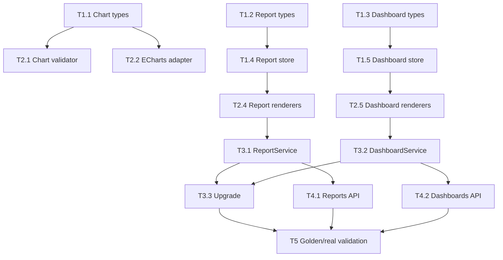

# CodeClaw Reports & Dashboards 开发任务和计划

## 1. 目标

第一阶段目标是交付一条最小但完整的产品链路：

```text
真实数据问题
-> 生成 ReportArtifact
-> 渲染 Report HTML
-> Report 升级 Dashboard 草稿
-> 渲染 Dashboard HTML
-> Web/API/CLI 可读取 artifact
```

本阶段不做完整 Dashboard editor、复杂权限、定时刷新、Dashboard Ask、PDF/PPTX 高保真导出。

## 1.1 Report 创建边界

当前阶段 Report 创建以 LLM 工具链为主：

- LLM 先完成数据探查、SQL 生成、规则检查、查询预览、图表建议、结论和 caveats。
- 然后调用 `CreateReportArtifact` 保存带 provenance 的 `ReportArtifact`。
- Web API 负责消费和管理已有 Report：列表、读取、HTML 预览、导出、升级 Dashboard。
- 当前不开放完整 `POST /v1/web/reports` 给前端直接创建，避免绕过 SQL provenance、rule check 和真实数据依据。

后续 TODO：

- 设计受控的前端草稿创建 API，例如 `POST /v1/web/reports/drafts`。
- 草稿创建必须标记 `provenance.source = "manual"`。
- UI 必须区分“AI 生成报表”、“手工草稿报表”、“数据已验证报表”。
- 手工草稿升级 Dashboard 前必须补齐数据来源、artifact 引用或显式风险提示。

## 2. 总体里程碑

| Milestone | 目标 | 主要产物 | 验收 |
| --- | --- | --- | --- |
| M1 | 类型和本地存储 | `src/charts`、`src/reports`、`src/dashboards` 基础 types/store | 单元测试可创建、读取、list |
| M2 | 校验和渲染 | validators、ECharts adapter、Report/Dashboard HTML | HTML 可生成，非法引用被拒绝 |
| M3 | 产品服务和工具 | Report/Dashboard services、本地工具注册 | QueryEngine 可调用产品工具 |
| M4 | Web API | Reports/Dashboards HTTP endpoints | Web API 可 list/read/render/upgrade |
| M5 | 黄金测试和真实验证 | DATA golden、真实 `chatbi_food_sales` 验证 | mock/real 关键链路通过 |

## 3. 任务分解

### M1：类型和本地 Store

#### T1.1 新增 chart 通用模型

文件：

- `src/charts/types.ts`
- `src/charts/ids.ts`

实现：

- 定义 `ChartKind`。
- 定义 `ChartSpec`。
- 定义 `ChartRenderInput`。
- 定义 `ChartQualityReview`。
- 定义稳定 id 生成函数。

验收：

- `npm run typecheck` 通过。
- 无 ECharts 依赖进入 `types.ts`。

#### T1.2 新增 Report 类型

文件：

- `src/reports/types.ts`
- `src/reports/ids.ts`

实现：

- 定义 `ReportArtifact`。
- 定义 `ReportDataset`、`ReportChart`、`ReportSection`、`ReportInsight`。
- 定义 `ReportExport`、`ReportProvenance`、`ReportAuditEvent`。
- 定义 `ArtifactRef`、`PrincipalRef` 可放 `src/reports/types.ts`，后续再抽公共包。

验收：

- 类型可被 store/service 引用。
- 不直接依赖 MCP 或 ECharts。

#### T1.3 新增 Dashboard 类型

文件：

- `src/dashboards/types.ts`
- `src/dashboards/ids.ts`

实现：

- 定义 `DashboardSpec`。
- 定义 `DashboardDataset`、`DashboardPage`、`DashboardWidget`。
- 定义 `DashboardFilter`、`DashboardParameter`、`DashboardInteraction`。
- 定义 `DashboardPermission`、`DashboardSchedule`、`DashboardSubscription`。

验收：

- 类型可表达一个单页、多 chart widget Dashboard。
- 不直接依赖 ECharts option。

#### T1.4 新增 FileReportStore

文件：

- `src/reports/store.ts`
- `test/unit/reports/report-store.test.ts`

实现：

- `create(report)`。
- `update(report)`。
- `read(id)`。
- `list(query)`。
- `appendAudit(id, event)`。
- artifact root 路径限制。
- 原子写入：先写 tmp，再 rename。

验收：

- 可写入 `report.json`。
- 可读取 `report.json`。
- list 能按 owner/workspace 过滤。
- 非 artifact root 路径被拒绝。

#### T1.5 新增 FileDashboardStore

文件：

- `src/dashboards/store.ts`
- `test/unit/dashboards/dashboard-store.test.ts`

实现：

- `create(spec)`。
- `update(spec)`。
- `read(id)`。
- `list(query)`。
- `writeVersion(spec)`。
- `appendAudit(id, event)`。

验收：

- 可写入 `dashboard.json`。
- 可读取 `dashboard.json`。
- 支持版本目录或 versions JSONL。
- list 能按 owner/workspace 过滤。

测试命令：

```bash
npm run test -- test/unit/reports/report-store.test.ts test/unit/dashboards/dashboard-store.test.ts
npm run typecheck
```

## 4. M2：校验和渲染

### T2.1 Chart validator

文件：

- `src/charts/validate.ts`
- `test/unit/charts/chart-validate.test.ts`

实现：

- 校验 `kind`。
- 校验 x/y/series 字段存在。
- 校验 pie 至少有一个维度和一个指标。
- 校验 scatter 需要两个数值字段。
- 校验 limit 上限。

验收：

- 非法字段引用被拒绝。
- 合法 bar/line/pie/scatter 通过。

### T2.2 ECharts adapter

文件：

- `src/charts/echartsAdapter.ts`
- `test/unit/charts/echarts-adapter.test.ts`

实现：

- `toEChartsOption(input)`。
- 支持 bar、line、area、pie、scatter。
- 支持 tooltip、legend、dataZoom、responsive 基础 option。
- 不支持的图表返回 warning，并建议 table fallback。
- 禁止输出 function formatter。

验收：

- `ChartSpec` 可转换为 ECharts option。
- option 不包含用户 JS。
- 核心类型不依赖 `echarts` npm 类型。

### T2.3 HTML runtime

文件：

- `src/charts/htmlRuntime.ts`

实现：

- 根据配置输出 ECharts runtime script。
- 支持 `cdn`、`local`、`none`。
- `none` 时 renderer 回退 table/artifact link。

验收：

- CDN 模式输出 script tag。
- local 模式输出本地相对路径。
- none 模式不输出 script。

### T2.4 Report validators/renderers

文件：

- `src/reports/validate.ts`
- `src/reports/renderMarkdown.ts`
- `src/reports/renderHtml.ts`
- `test/unit/reports/report-validate.test.ts`
- `test/unit/reports/report-render.test.ts`

实现：

- 校验 dataset/chart/section 引用。
- 校验 artifact path。
- Markdown renderer。
- HTML renderer。
- ECharts 可用时渲染图表容器和 option JSON。
- ECharts 不可用时展示 table/PNG/artifact link。

验收：

- Report HTML 包含标题、问题、结论、图表、数据、SQL、caveats。
- HTML escape。
- 大结果不内嵌。

### T2.5 Dashboard validators/renderers

文件：

- `src/dashboards/validate.ts`
- `src/dashboards/renderHtml.ts`
- `test/unit/dashboards/dashboard-validate.test.ts`
- `test/unit/dashboards/dashboard-render.test.ts`

实现：

- 校验 page/widget/dataset/filter/interaction 引用。
- 静态 grid 布局。
- 支持 chart/table/metric/text widget。
- ECharts 可用时渲染 chart widget。
- 不可用时回退。

验收：

- Dashboard HTML 可离线打开。
- 无效 widget dataset 引用被拒绝。

测试命令：

```bash
npm run test -- test/unit/charts/chart-validate.test.ts test/unit/charts/echarts-adapter.test.ts test/unit/reports/report-validate.test.ts test/unit/reports/report-render.test.ts test/unit/dashboards/dashboard-validate.test.ts test/unit/dashboards/dashboard-render.test.ts
npm run typecheck
npm run lint
```

## 5. M3：Service 和本地产品工具

### T3.1 ReportService

文件：

- `src/reports/service.ts`
- `test/unit/reports/report-service.test.ts`

实现：

- `create(input)`。
- `renderMarkdown(id)`。
- `renderHtml(id)`。
- `read(id)`。
- `list(query)`。

验收：

- 创建 Report 后自动写 `report.json`。
- render 后写 `report.md` 和 `report.html`。

### T3.2 DashboardService

文件：

- `src/dashboards/service.ts`
- `test/unit/dashboards/dashboard-service.test.ts`

实现：

- `create(input)`。
- `validate(idOrSpec)`。
- `renderHtml(id)`。
- `read(id)`。
- `list(query)`。

验收：

- 创建 Dashboard 后自动写 `dashboard.json`。
- render 后写 `dashboard.html`。

### T3.3 Report 升级 Dashboard

文件：

- `src/dashboards/upgrade.ts`
- `test/unit/dashboards/dashboard-upgrade.test.ts`

实现：

- `upgradeReportToDashboard(input, deps)`。
- ReportDataset -> DashboardDataset。
- ReportChart -> DashboardWidget。
- ReportSection -> text/insight widget。
- 默认单 page。
- 默认 manual refresh。
- 写入 `sourceReportId`。

验收：

- Report 可升级为 Dashboard 草稿。
- Dashboard 保留 provenance。
- 可通过 Dashboard validator。

### T3.4 产品工具注册

文件：

- `src/reports/tools.ts`
- `src/dashboards/tools.ts`
- `src/agent/tools/registry.ts`
- `test/unit/agent/tools/builtins.test.ts`

实现工具：

- `CreateReportArtifact`
- `RenderReportHtml`
- `ReadReport`
- `ListReports`
- `UpgradeReportToDashboard`
- `CreateDashboardSpec`
- `ValidateDashboardSpec`
- `RenderDashboardHtml`
- `ReadDashboard`
- `ListDashboards`

验收：

- QueryEngine 工具列表能看到新工具。
- 工具结果遵守 artifact summary 策略。
- 工具不会调用 Beelink 数据平台。

测试命令：

```bash
npm run test -- test/unit/reports/report-service.test.ts test/unit/dashboards/dashboard-service.test.ts test/unit/dashboards/dashboard-upgrade.test.ts test/unit/agent/tools/builtins.test.ts
npm run typecheck
npm run lint
```

## 6. M4：Web API

### T4.1 Reports API

文件：

- `src/channels/web/reportHandlers.ts`
- `src/channels/web/server.ts`
- `test/web-reports.test.ts`

路由：

```text
GET  /v1/web/reports
GET  /v1/web/reports/:id
GET  /v1/web/reports/:id/html
POST /v1/web/reports/:id/export
POST /v1/web/reports/:id/upgrade-dashboard
```

验收：

- 鉴权失败返回 401。
- list 只返回当前 user。
- HTML endpoint 返回 `text/html`。
- upgrade 返回 dashboard id。

### T4.2 Dashboards API

文件：

- `src/channels/web/dashboardHandlers.ts`
- `src/channels/web/server.ts`
- `test/web-dashboards.test.ts`

路由：

```text
GET  /v1/web/dashboards
GET  /v1/web/dashboards/:id
GET  /v1/web/dashboards/:id/html
POST /v1/web/dashboards
POST /v1/web/dashboards/:id/render
POST /v1/web/dashboards/:id/validate
```

验收：

- list/read/html/render/validate 可用。
- 非 owner 暂时不可见。

测试命令：

```bash
npm run test -- test/web-reports.test.ts test/web-dashboards.test.ts
npm run typecheck
npm run lint
```

## 7. M5：黄金测试和真实验证

### T5.1 更新黄金测试工具允许列表

文件：

- `test/golden/runner/data-invoker.ts`
- `test/golden/data/DATA-100.yaml`

新增工具允许：

- `CreateReportArtifact`
- `RenderReportHtml`
- `UpgradeReportToDashboard`
- `ValidateDashboardSpec`
- `RenderDashboardHtml`

验收：

- mock golden runner 可以识别新工具。

### T5.2 新增 Report/Dashboard 黄金题

建议新增题目：

- “基于 `chatbi_food_sales` 生成一份销售分析报告。”
- “报告里必须包含销量最高商品、销售额最高商品和图表。”
- “把刚才的报告升级成 Dashboard。”
- “渲染 Dashboard HTML。”
- “大结果保存 artifact，不要刷终端。”

验收：

- Mock golden 通过。
- 不要求真实模型每次都生成完全一样文本，但必须调用关键工具。

### T5.3 真实数据验证

命令：

```bash
DATA_GOLDEN_REAL_TIMEOUT_MS=180000 TMPDIR=/private/tmp npm run golden:data -- --real --id DATA-REPORT-001 --verbose
DATA_GOLDEN_REAL_TIMEOUT_MS=180000 TMPDIR=/private/tmp npm run golden:data -- --real --id DATA-DASHBOARD-001 --verbose
```

验收：

- 能基于 `chatbi_food_sales` 生成 Report。
- Report 能升级 Dashboard。
- Dashboard HTML artifact 存在。
- 终端输出不超过渲染预算。

## 8. 依赖关系



## 9. 风险和控制

| 风险 | 控制 |
| --- | --- |
| ECharts 侵入核心模型 | `ChartSpec` 保持中立，ECharts 只在 adapter/runtime |
| 第一阶段范围过大 | 严格先做静态 Report/Dashboard HTML |
| 大结果污染上下文 | 所有 result/artifact ref，不内嵌大 JSON |
| HTML 注入风险 | renderer escape，禁止自定义 JS formatter |
| MCP 边界混乱 | Beelink MCP 只做数据工具，产品对象在 CodeClaw Core |
| Web API 权限不足 | 第一阶段 owner 过滤，企业阶段 ACL |
| 真实模型调用不稳定 | 先 mock golden，再少量 real golden |

## 10. 完成定义

第一阶段完成必须同时满足：

- `npm run typecheck` 通过。
- `npm run lint` 通过。
- 新增 unit tests 通过。
- Report/Dashboard mock golden 通过。
- 至少一个真实 `chatbi_food_sales` Report -> Dashboard 链路通过。
- 生成 artifact 可在本地打开。
- Beelink MCP 没有被产品状态污染。
- 技术文档和进度日志同步更新。
