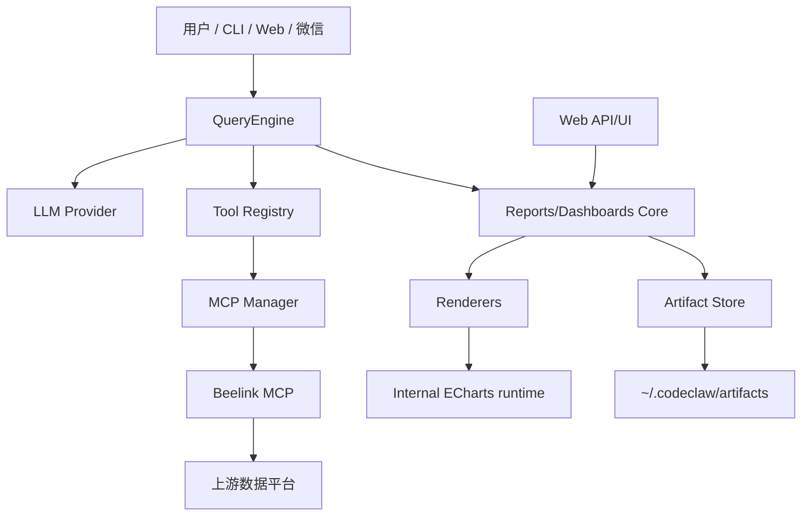

# CodeClaw Reports & Dashboards 技术详细设计

## 1. 设计目标

本设计把 `Reports` 和 `Dashboards` 落到代码级实现，目标是先形成一条可验证闭环：

```text
用户问题
-> Beelink/Data MCP 获取真实数据
-> CodeClaw Core 生成 ReportArtifact
-> Web/CLI 展示报告 artifact
-> 用户一键升级为 DashboardSpec
-> Dashboard HTML 渲染
```

核心原则：

- MCP 负责数据和 AI 工具能力，不承载完整产品状态。
- Reports/Dashboards 属于 CodeClaw Core/Web 产品层。
- 所有大结果 artifact-backed，不进入完整对话上下文。
- 所有 SQL、query id、图表、结论、导出物都可追溯。
- 先本地 artifact store，后续再演进到企业服务。

## 2. 当前可复用基础

当前代码中可以直接复用的模块：

| 现有模块 | 作用 | 复用方式 |
| --- | --- | --- |
| `src/agent/tools/artifact.ts` | 大文本落盘、`read_artifact` | 复用 artifact root、安全读取、摘要策略 |
| `src/mcp/*` | MCP manager/client/bridge | LLM 和 Web 调用 Beelink 等 MCP；图表不依赖 ECharts MCP |
| `packages/beelink-mcp/src/server.ts` | Beelink MCP 工具入口 | 保持数据工具层边界 |
| `packages/beelink-mcp/src/metadataStore.ts` | 本地元数据索引 | Report/Dashboard 生成前的语义和字段上下文来源 |
| `src/channels/web/server.ts` | Web HTTP server | 增加 reports/dashboards API 路由 |
| `src/channels/web/handlers.ts` | Web handler 模式 | 新增 report/dashboard handlers |
| `src/storage/db.ts` | SQLite data.db singleton | 企业阶段可迁移 Report/Dashboard metadata |
| `src/storage/migrations/data` | data.db migration | 后续增加 product metadata 表 |
| `test/golden/data/DATA-100.yaml` | 数据分析黄金测试 | 增加 Report/Dashboard 黄金用例 |

### 2.1 当前已实现矩阵

这份设计最初是开发计划，现在已有一批核心模块落地。后续阅读时以本矩阵判断当前状态：

| 能力 | 当前状态 | 主要位置 |
| --- | --- | --- |
| Report product object / store / service | 已实现 | `src/reports/types.ts`, `src/reports/store.ts`, `src/reports/service.ts` |
| Report validate / Markdown / HTML render | 已实现 | `src/reports/validate.ts`, `src/reports/renderMarkdown.ts`, `src/reports/renderHtml.ts` |
| Report native tools | 已实现 | `src/reports/tools.ts` (`CreateReportArtifact`, `UpdateReportArtifact`, `ReadReport`, `ListReports`, `RenderReportHtml`) |
| Report Office export | 已实现基础版 | `src/reports/exportOffice.ts`, `src/office/ooxmlZip.ts`, `ExportReportArtifact`；支持本地 DOCX/PPTX artifact，并可嵌入已有 PNG chart image artifact |
| Dashboard product object / store / service | 已实现 | `src/dashboards/types.ts`, `src/dashboards/store.ts`, `src/dashboards/service.ts` |
| Dashboard validate / HTML render / upgrade | 已实现 | `src/dashboards/validate.ts`, `src/dashboards/renderHtml.ts`, `src/dashboards/upgrade.ts` |
| Dashboard native tools | 已实现 | `src/dashboards/tools.ts` (`CreateDashboardSpec`, `ValidateDashboardSpec`, `RenderDashboardHtml`, `UpgradeReportToDashboard`) |
| Web list/detail/render/upgrade API | 已实现基础版 | `src/channels/web/reportHandlers.ts`, `src/channels/web/dashboardHandlers.ts` |
| Web React Reports/Dashboards viewer | 已实现基础版 | `web-react/src/*` |
| Provenance display | 已实现基础版 | Report/Dashboard detail panels and renderers |
| Product-flow golden smoke | 已实现 | `test/golden/report-dashboard/product-flow.test.ts` |
| Frontend direct Report draft creation | 仍是 TODO | 设计上暂以 LLM 工具链创建为主 |
| Enterprise ACL, scheduler, editor, subscriptions | 仍是未来范围 | 企业版后续阶段 |

## 3. 分层架构



分层职责：

| 层级 | 模块 | 职责 |
| --- | --- | --- |
| 数据工具层 | Beelink MCP | 元数据、语义、SQL 校验、SQL 执行、preview/artifact |
| AI 编排层 | QueryEngine | 决定调用哪些工具、生成 SQL、生成报告叙事、调用产品工具 |
| 产品核心层 | `src/reports`、`src/dashboards` | Product object、store、validator、renderer、upgrade |
| Web 层 | `src/channels/web`、`web-react` | 列表、详情、viewer、editor、导出、升级入口 |
| Artifact 层 | `~/.codeclaw/artifacts` | JSON/HTML/PNG/PDF/PPTX/DOCX/audit.jsonl |

## 4. 目录规划

第一阶段已新增这些代码目录；后续新增模块应继续保持同样边界：

```text
src/reports/
  types.ts
  ids.ts
  store.ts
  validate.ts
  renderMarkdown.ts
  renderHtml.ts
  service.ts
  tools.ts

src/dashboards/
  types.ts
  ids.ts
  store.ts
  validate.ts
  renderHtml.ts
  upgrade.ts
  service.ts
  tools.ts

src/charts/
  types.ts
  infer.ts
  validate.ts
  echartsAdapter.ts
  htmlRuntime.ts

src/channels/web/
  reportHandlers.ts
  dashboardHandlers.ts

test/unit/reports/
  report-store.test.ts
  report-render.test.ts
  report-validate.test.ts

test/unit/dashboards/
  dashboard-store.test.ts
  dashboard-render.test.ts
  dashboard-upgrade.test.ts
  dashboard-validate.test.ts
```

暂不建议放入 `packages/beelink-mcp`，因为 Reports/Dashboards 是 CodeClaw 产品对象，不是单一数据源工具。

## 5. 核心类型设计

### 5.1 通用类型

```ts
export interface PrincipalRef {
  type: "user" | "service" | "team";
  id: string;
  displayName?: string;
}

export interface ArtifactRef {
  path: string;
  kind: "json" | "markdown" | "html" | "png" | "pdf" | "pptx" | "docx" | "text";
  bytes?: number;
  sha256?: string;
  createdAt: string;
}

export interface SqlProvenance {
  sql: string;
  queryId?: string;
  mcpServer?: string;
  toolName?: string;
  generatedBy?: {
    provider?: string;
    model?: string;
  };
  ruleCheck?: {
    passed: boolean;
    errors: string[];
    warnings: string[];
  };
}

export interface DataCaveat {
  code:
    | "metadata_incomplete"
    | "permission_limited"
    | "stale_artifact"
    | "preview_truncated"
    | "semantic_uncertain"
    | "chart_inferred";
  message: string;
}
```

### 5.2 ReportArtifact

文件：`src/reports/types.ts`

```ts
export interface ReportArtifact {
  version: 1;
  id: string;
  title: string;
  question: string;
  owner: PrincipalRef;
  workspaceId: string;
  sessionId?: string;
  traceId?: string;
  createdAt: string;
  updatedAt: string;
  status: "draft" | "reviewed" | "shared" | "archived";
  datasets: ReportDataset[];
  charts: ReportChart[];
  sections: ReportSection[];
  insights: ReportInsight[];
  caveats: DataCaveat[];
  exports: ReportExport[];
  provenance: ReportProvenance;
  upgrade?: ReportUpgradeState;
}

export interface ReportDataset {
  id: string;
  name: string;
  sql?: string;
  queryId?: string;
  previewRows: number;
  rowCount?: number;
  columns: ReportColumn[];
  previewArtifact?: ArtifactRef;
  resultArtifact?: ArtifactRef;
  provenance?: SqlProvenance;
}

export interface ReportChart {
  id: string;
  title: string;
  datasetId: string;
  chart: ChartSpec;
  chartArgsArtifact?: ArtifactRef;
  imageArtifact?: ArtifactRef;
  htmlArtifact?: ArtifactRef;
  quality?: ChartQualityReview;
}

export interface ReportSection {
  id: string;
  title: string;
  markdown: string;
  datasetIds?: string[];
  chartIds?: string[];
}
```

Report 不处理复杂交互，只关注一次性分析结论。

### 5.3 DashboardSpec

文件：`src/dashboards/types.ts`

```ts
export interface DashboardSpec {
  version: 1;
  id: string;
  title: string;
  description?: string;
  owner: PrincipalRef;
  workspaceId: string;
  createdAt: string;
  updatedAt: string;
  status: "draft" | "published" | "archived";
  sourceReportId?: string;
  datasets: DashboardDataset[];
  pages: DashboardPage[];
  filters: DashboardFilter[];
  parameters: DashboardParameter[];
  interactions: DashboardInteraction[];
  permissions: DashboardPermission[];
  schedules: DashboardSchedule[];
  subscriptions: DashboardSubscription[];
  provenance: DashboardProvenance;
  lifecycle: DashboardLifecycle;
}

export interface DashboardDataset {
  id: string;
  name: string;
  kind: "sql" | "artifact" | "semantic_metric" | "external_mcp";
  sql?: string;
  sourceArtifact?: ArtifactRef;
  resultArtifact?: ArtifactRef;
  previewRows: number;
  rowCount?: number;
  columns: DashboardColumn[];
  refresh: DashboardRefreshPolicy;
  safety: DashboardDatasetSafety;
  provenance?: SqlProvenance;
}
```

Dashboard 是长期对象，必须考虑刷新、权限、发布和审计。

## 6. Artifact Store 设计

### 6.1 路径

默认路径沿用 `.codeclaw/artifacts`：

```text
~/.codeclaw/artifacts/reports/<report-id>/
  report.json
  report.md
  report.html
  datasets/
    <dataset-id>.preview.json
    <dataset-id>.result.json
  charts/
    <chart-id>.args.json
    <chart-id>.png
  exports/
    report.docx
    report.pdf
    report.pptx
  audit.jsonl

~/.codeclaw/artifacts/dashboards/<dashboard-id>/
  dashboard.json
  dashboard.html
  datasets/
    <dataset-id>.result.json
  charts/
    <widget-id>.args.json
    <widget-id>.png
  exports/
    dashboard.docx
    dashboard.pdf
    dashboard.pptx
  audit.jsonl
```

### 6.2 Store 接口

文件：

- `src/reports/store.ts`
- `src/dashboards/store.ts`

```ts
export interface ReportStore {
  create(report: ReportArtifact): Promise<ReportArtifact>;
  update(report: ReportArtifact): Promise<ReportArtifact>;
  read(id: string): Promise<ReportArtifact>;
  list(query: ReportListQuery): Promise<ReportListResult>;
  writeExport(id: string, exportRef: ArtifactRef): Promise<void>;
  appendAudit(id: string, event: ReportAuditEvent): Promise<void>;
}

export interface DashboardStore {
  create(spec: DashboardSpec): Promise<DashboardSpec>;
  update(spec: DashboardSpec): Promise<DashboardSpec>;
  read(id: string): Promise<DashboardSpec>;
  list(query: DashboardListQuery): Promise<DashboardListResult>;
  writeVersion(spec: DashboardSpec): Promise<DashboardVersion>;
  appendAudit(id: string, event: DashboardAuditEvent): Promise<void>;
}
```

第一阶段实现 `FileReportStore` 和 `FileDashboardStore`。企业阶段再加 SQLite/服务端实现。

### 6.3 写入规则

- JSON 使用 pretty format，便于 review。
- 写入前先写临时文件，再 `rename`，避免半写入。
- 所有路径必须在 artifact root 内。
- 保存前做 basic secret scan。
- 大数据只写 artifact，不写进 `report.json` 或 `dashboard.json`。

## 7. Service 设计

### 7.1 ReportService

文件：`src/reports/service.ts`

```ts
export interface CreateReportInput {
  title?: string;
  question: string;
  owner: PrincipalRef;
  workspaceId: string;
  sessionId?: string;
  datasets: ReportDataset[];
  charts?: ReportChart[];
  sections?: ReportSection[];
  insights?: ReportInsight[];
  caveats?: DataCaveat[];
  provenance: ReportProvenance;
}

export class ReportService {
  constructor(private readonly store: ReportStore) {}

  async create(input: CreateReportInput): Promise<ReportArtifact>;
  async renderMarkdown(id: string): Promise<ArtifactRef>;
  async renderHtml(id: string): Promise<ArtifactRef>;
  async exportReport(id: string, format: "html" | "markdown" | "docx" | "pdf" | "pptx"): Promise<ArtifactRef>;
  async read(id: string): Promise<ReportArtifact>;
  async list(query: ReportListQuery): Promise<ReportListResult>;
}
```

### 7.2 DashboardService

文件：`src/dashboards/service.ts`

```ts
export interface CreateDashboardInput {
  title: string;
  owner: PrincipalRef;
  workspaceId: string;
  sourceReportId?: string;
  datasets: DashboardDataset[];
  pages: DashboardPage[];
  filters?: DashboardFilter[];
  parameters?: DashboardParameter[];
  interactions?: DashboardInteraction[];
  provenance: DashboardProvenance;
}

export class DashboardService {
  constructor(private readonly store: DashboardStore) {}

  async create(input: CreateDashboardInput): Promise<DashboardSpec>;
  async validate(idOrSpec: string | DashboardSpec): Promise<DashboardValidationResult>;
  async renderHtml(id: string): Promise<ArtifactRef>;
  async read(id: string): Promise<DashboardSpec>;
  async list(query: DashboardListQuery): Promise<DashboardListResult>;
}
```

### 7.3 UpgradeService

文件：`src/dashboards/upgrade.ts`

```ts
export interface UpgradeReportToDashboardInput {
  reportId: string;
  title?: string;
  owner: PrincipalRef;
  workspaceId: string;
  includeChartIds?: string[];
  refreshMode?: "manual" | "scheduled";
}

export async function upgradeReportToDashboard(
  input: UpgradeReportToDashboardInput,
  deps: {
    reportStore: ReportStore;
    dashboardStore: DashboardStore;
  }
): Promise<DashboardSpec>;
```

升级规则：

- `ReportDataset` 转 `DashboardDataset`。
- `ReportChart` 转 `DashboardWidget(type="chart")`。
- `ReportSection` 可转 `DashboardWidget(type="text" | "insight")`。
- 默认生成一个 page，后续再支持多 page。
- 默认 `refresh.mode = "manual"`，除非用户明确要求定时刷新。
- 保留 `sourceReportId` 和 provenance。

## 8. Validator 设计

### 8.1 Report 校验

文件：`src/reports/validate.ts`

校验项：

- `version === 1`。
- `id/title/question/owner/workspaceId` 必填。
- Dataset 至少一个。
- Chart 引用的 dataset 必须存在。
- Section 引用的 chart/dataset 必须存在。
- Artifact path 必须在 artifact root 内。
- SQL 如果存在，必须有 rule-check provenance 或 caveat。
- 不允许将全量大结果直接内嵌进 JSON。

### 8.2 Dashboard 校验

文件：`src/dashboards/validate.ts`

校验项：

- `version === 1`。
- 至少一个 page。
- Widget id 全局唯一。
- Widget 引用的 dataset 必须存在。
- Filter/parameter/interactions 引用字段必须存在于对应 dataset。
- `sql` dataset 必须有 `readOnlyChecked === true`。
- Published dashboard 必须有 owner 和 permissions。
- Schedule credential mode 必须显式声明。

## 9. Chart 与 ECharts 技术边界

### 9.1 结论

CodeClaw 需要引入开源 ECharts，但 ECharts 只能作为渲染适配器和前端运行时，不能成为产品核心模型。

正确边界：

```text
CodeClaw ChartSpec
-> EChartsAdapter
-> ECharts option
-> Report/Dashboard HTML renderer
-> 浏览器 ECharts runtime 渲染
```

不建议这样做：

```text
ReportArtifact / DashboardSpec 直接绑定 echarts.Option
```

原因：

- 企业版后续可能支持 AntV、Vega-Lite、Plotly、Tableau-like renderer。
- 产品模型要表达业务图表语义，而不是某个图表库的私有 option。
- LLM 更容易稳定生成通用 `ChartSpec`，再由 adapter 负责细节。
- 后续 PNG/PDF/PPTX 渲染可以替换 renderer，不影响 Report/Dashboard 数据结构。

### 9.2 哪些地方使用 ECharts

| 位置 | 是否使用 ECharts | 说明 |
| --- | --- | --- |
| `src/charts/types.ts` | 不使用 | 定义 CodeClaw 自有 `ChartSpec`，保持图表语义中立 |
| `src/reports/types.ts` | 不直接使用 | 只保存 `ChartSpec` 和 artifact refs |
| `src/dashboards/types.ts` | 不直接使用 | 只保存 `ChartSpec`、widget、layout、交互定义 |
| `src/charts/echartsAdapter.ts` | 使用 | 将 `ChartSpec + rows` 转换成 ECharts option |
| `src/reports/renderHtml.ts` | 使用生成结果 | 内嵌或引用 ECharts runtime 渲染图表 |
| `src/dashboards/renderHtml.ts` | 使用生成结果 | Dashboard HTML viewer 使用 ECharts runtime |
| `web-react` | 使用 | Web viewer/editor 中渲染图表预览 |
| Beelink MCP | 不使用 | Beelink 只负责数据、SQL、metadata，不负责产品渲染 |
| ECharts MCP | 不使用 | 已从标准链路移除；图表必须通过 Report/Dashboard chart spec 保存 |

### 9.3 新增 chart 模块

建议新增：

```text
src/charts/
  types.ts
  infer.ts
  validate.ts
  echartsAdapter.ts
  htmlRuntime.ts
```

职责：

- `types.ts`：定义通用 `ChartSpec`、`ChartDataset`、`ChartRenderInput`。
- `infer.ts`：根据字段类型和用户意图推荐图表类型。
- `validate.ts`：校验 chart 绑定字段是否存在、维度/指标是否合理。
- `echartsAdapter.ts`：转换为 ECharts option。
- `htmlRuntime.ts`：输出 HTML renderer 需要的 script/css/runtime 片段。

### 9.4 ChartSpec

文件：`src/charts/types.ts`

```ts
export type ChartKind =
  | "bar"
  | "line"
  | "area"
  | "pie"
  | "scatter"
  | "combo"
  | "heatmap"
  | "histogram"
  | "box"
  | "funnel"
  | "gauge"
  | "map"
  | "pivot";

export interface ChartSpec {
  kind: ChartKind;
  title?: string;
  x?: string;
  y?: string | string[];
  series?: string;
  color?: string;
  sort?: "asc" | "desc" | "none";
  limit?: number;
  aggregation?: "sum" | "count" | "avg" | "min" | "max" | "none";
  options?: {
    stacked?: boolean;
    horizontal?: boolean;
    showLegend?: boolean;
    showTooltip?: boolean;
    showDataZoom?: boolean;
  };
  forecast?: ForecastSpec;
  anomaly?: AnomalySpec;
}

export interface ChartRenderInput {
  spec: ChartSpec;
  rows: Array<Record<string, unknown>>;
  columns: Array<{ name: string; type?: string; semanticRole?: string }>;
}
```

注意：`ChartSpec` 中不放 `echartsOption`。如果需要调试或缓存 ECharts option，放在 artifact 中：

```text
charts/<chart-id>.echarts.json
```

### 9.5 EChartsAdapter

文件：`src/charts/echartsAdapter.ts`

```ts
export interface EChartsRenderResult {
  option: unknown;
  warnings: string[];
}

export function toEChartsOption(input: ChartRenderInput): EChartsRenderResult;
```

转换规则：

- `bar`：`xAxis.type = "category"`，`yAxis.type = "value"`。
- `line`：日期/时间字段作为 x，数值字段作为 y。
- `area`：基于 line，增加 `areaStyle`。
- `pie`：一个维度 + 一个数值字段，限制 top-N。
- `scatter`：两个数值字段。
- `combo`：多指标，允许 bar + line 组合。
- `heatmap`：两个维度 + 一个数值字段。
- `gauge`：单指标卡扩展。
- `pivot`：第一阶段不转复杂 ECharts，先回退 table。

### 9.6 第一阶段使用的 ECharts 能力

第一阶段只使用稳定、低复杂度能力：

- `bar`
- `line`
- `area`
- `pie`
- `scatter`
- `table fallback`
- `tooltip`
- `legend`
- `dataZoom`
- `responsive resize`

第一阶段不做：

- 地图底图。
- 复杂 3D。
- 自定义 JS formatter。
- 复杂主题编辑器。
- 高级动画编排。
- 服务端 PNG 渲染强依赖。

### 9.7 HTML 中如何引入 ECharts

分阶段：

#### P2 本地 artifact 阶段

Report/Dashboard HTML 可以使用 CDN 或本地 vendor 文件，两种模式由配置控制：

```text
CODECLAW_ECHARTS_RUNTIME=cdn | local | none
CODECLAW_ECHARTS_CDN_URL=https://cdn.jsdelivr.net/npm/echarts@5/dist/echarts.min.js
CODECLAW_ECHARTS_LOCAL_PATH=~/.codeclaw/vendor/echarts/echarts.min.js
```

默认建议：

- 开发环境：`cdn`。
- 企业/离线环境：`local`。
- 如果两者都不可用：回退为静态表格和 chart args artifact 链接。

#### 企业 Web 阶段

`web-react` 直接依赖 `echarts` npm 包：

```text
web-react package
-> import * as echarts from "echarts/core"
-> 按需注册 bar/line/pie/scatter 等 chart
```

Web 端可以比静态 artifact 更强，但仍应消费同一份 `ChartSpec`。

### 9.8 PNG/PDF/PPTX 渲染策略

不要在第一阶段强行引入复杂服务端 ECharts 渲染依赖。

推荐顺序：

1. HTML 先可用。
2. PNG 优先使用浏览器截图能力生成；不要依赖 ECharts MCP。
3. PDF 使用 HTML -> PDF 渲染管线。
4. PPTX 使用报告结构和 chart PNG artifact 生成。

如果服务端要直接生成 PNG，后续再评估：

- headless browser。
- `echarts` + canvas。
- 独立 chart rendering worker。

### 9.9 安全规则

- ECharts option 必须由 adapter 生成，不接受用户原始 JS。
- 禁止自定义 formatter function 字符串。
- 所有标题、legend、axis label、tooltip 文本必须 HTML escape。
- HTML renderer 中只注入 JSON，不注入可执行用户内容。
- chart rows 超过限制时必须采样或要求聚合。

## 10. Renderer 设计

### 10.1 Report Markdown Renderer

文件：`src/reports/renderMarkdown.ts`

输出结构：

```text
# <report title>

## 问题
<question>

## 结论
<insights>

## 图表
<chart refs>

## 数据
<preview tables / artifact refs>

## SQL 和来源
<sql/query id/provenance>

## 风险提示
<caveats>
```

### 10.2 Report HTML Renderer

文件：`src/reports/renderHtml.ts`

第一阶段使用静态 HTML：

- 内联基础 CSS。
- 表格展示 preview。
- 图表优先使用 `ChartSpec -> EChartsAdapter -> ECharts option` 渲染。
- 如果没有 ECharts runtime，则回退显示 PNG artifact 或 chart args JSON 链接。
- 所有 artifact 链接使用相对路径。

### 10.3 Dashboard HTML Renderer

文件：`src/dashboards/renderHtml.ts`

第一阶段：

- 静态 Dashboard HTML。
- 基于 grid 布局。
- widget 支持 `chart`、`table`、`metric`、`text`。
- 图表优先使用 ECharts runtime 渲染。
- ECharts 不可用时回退 table/PNG/artifact link。
- 暂不实现复杂交互，只渲染 filters/parameters 的只读摘要。

第二阶段：

- 客户端过滤 artifact dataset。
- Cross-filter。
- Drill-through。
- Dashboard Ask 入口。

## 10.4 Office 导出设计：Word / PowerPoint

Office 导出属于 CodeClaw 产品层能力，不属于 Beelink MCP，也不依赖外部 Office 服务。它消费已经保存的 `ReportArtifact` / `DashboardSpec`，生成本地 artifact，后续可被 Web 下载、邮件发送或企业分享策略复用。

### 10.4.1 目标和非目标

目标：

- Report 可导出为 `.docx` 和 `.pptx`，满足分析汇报、评审、归档场景。
- Dashboard 可导出为 `.pptx`，用于管理层汇报；`.docx` 仅作为未来补充。
- 导出物必须携带 provenance：report/dashboard id、问题、workspace、query id、SQL、preview 截断状态、model/provider、caveats。
- 没有图表图片时，必须回退到表格和 ChartSpec 摘要，不能生成空白页或声称图表已渲染。

非目标：

- 第一版不做 Office 在线协作、云端编辑、邮件发送或权限外发。
- 第一版不做像素级高保真 Dashboard 复刻；PPTX 以“汇报型重排”为主。
- 不把 Word/PPT 模板逻辑放进 Beelink MCP。

### 10.4.2 模块边界

建议新增：

```text
src/reports/exportOffice.ts
src/reports/exportDocx.ts
src/reports/exportPptx.ts
src/dashboards/exportPptx.ts
src/office/
  types.ts
  template.ts
  provenanceAppendix.ts
```

职责：

- `ReportService.exportReport()` 负责读取、hydrate、校验和写入 export artifact。
- `exportDocx.ts` / `exportPptx.ts` 只负责格式渲染，不访问 LLM、不执行 SQL。
- `src/office/*` 放通用模板、主题、provenance appendix、表格/图片转换逻辑。
- Web handler 只接收导出请求并返回 artifact ref / download URL，不直接拼文档。

### 10.4.3 Native Tool 设计

建议先使用一个通用工具，避免工具膨胀：

```text
ExportReportArtifact
input:
  reportId: string
  format: "markdown" | "html" | "docx" | "pptx"
  options?:
    includeCharts?: boolean
    includeProvenance?: boolean
    templateId?: string
    theme?: "default" | "executive" | "technical"
output:
  artifact: ArtifactRef
  warnings: string[]
```

Dashboard 后续对应：

```text
ExportDashboardArtifact
input:
  dashboardId: string
  format: "html" | "pptx" | "json"
```

权限定位：

- 本地 artifact 写入是中低风险；不外发、不打开网络连接。
- 如果导出后要发邮件、上传网盘或调用企业分享接口，必须走单独高风险工具和审批。

### 10.4.4 Web API 设计

```text
POST /v1/web/reports/:id/export
body: { "format": "docx" | "pptx" | "html" | "markdown", "options": {...} }

GET /v1/web/reports/:id/exports/:exportId/download

POST /v1/web/dashboards/:id/export
body: { "format": "pptx" | "html" | "json", "options": {...} }
```

Web UI：

- Report 详情页增加“导出 Word”和“导出 PPT”按钮。
- Dashboard 详情页增加“导出 PPT”按钮。
- 导出失败时展示可行动错误：缺 chart image、artifact 丢失、provenance 不完整、模板不可用。

### 10.4.5 DOCX 生成规则

Report DOCX 采用文档型结构：

```text
封面：标题、问题、生成时间、workspace
执行摘要：insights
分析正文：sections
图表：chart image 优先；无 image 时使用 chart spec + 数据表回退
数据表：preview rows，不嵌入超大结果
风险提示：caveats
来源附录：SQL、query id、artifact、model/provider、rule check
```

渲染原则：

- 不把完整大数据写进 DOCX，只写 preview 和 artifact 引用。
- 所有 SQL 默认放入附录，避免正文过长。
- 如果 `preview_truncated=true`，必须在数据表标题旁标注。

### 10.4.6 PPTX 生成规则

Report PPTX 采用汇报型结构：

```text
1. Title slide
2. Executive summary
3. One insight per slide
4. One chart/table per slide
5. Caveats and provenance appendix
```

Dashboard PPTX 采用页面型结构：

```text
1. Dashboard overview
2. One dashboard page -> one or more slides
3. KPI widgets first, charts second, table appendix last
4. Refresh/schedule/provenance appendix
```

图表策略：

- 优先使用 `chart.imageArtifact`。当前基础版已支持嵌入 `kind="png"` 的 chart image artifact。
- 其次使用 internal chart renderer 生成 PNG。
- 都不可用时，降级为表格页，并在 warnings 中说明。

### 10.4.7 Artifact 和审计

导出产物路径：

```text
~/.codeclaw/artifacts/reports/<report-id>/exports/report.docx
~/.codeclaw/artifacts/reports/<report-id>/exports/report.pptx
~/.codeclaw/artifacts/dashboards/<dashboard-id>/exports/dashboard.pptx
```

每次导出必须：

- 调用 `store.writeExport()` 写回 `exports[]`。
- 追加 audit event：`action="export"`，`details={ format, templateId, warnings }`。
- 在 artifact metadata 中保存 sha256、bytes、createdAt。

### 10.4.8 测试计划

单元测试：

- `ReportService.exportReport("docx")` 写出 artifact 并更新 `exports[]`。
- `ReportService.exportReport("pptx")` 无 chart image 时降级为表格且返回 warning。
- provenance appendix 包含 SQL、query id、model/provider、truncated 状态。

Web 测试：

- `POST /v1/web/reports/:id/export` 支持 `docx/pptx`。
- 下载接口只能读取 artifact root 内文件。

Golden：

- 从真实数据 Report 生成 DOCX/PPTX，断言文件存在、非空、包含标题和 provenance。

真实验证：

- 用 `@xu.sample_sales_daily` 或等价测试表生成 Report。
- 导出 DOCX/PPTX。
- 打开文件确认标题、核心结论、表格、图表降级提示、来源附录完整。

## 11. Tool 暴露设计

### 11.1 本地产品工具

文件：

- `src/reports/tools.ts`
- `src/dashboards/tools.ts`

建议向 QueryEngine tool registry 注册：

```text
CreateReportArtifact
RenderReportHtml
ReadReport
ListReports
UpgradeReportToDashboard
CreateDashboardSpec
ValidateDashboardSpec
RenderDashboardHtml
ReadDashboard
ListDashboards
ExportReportArtifact
ExportDashboardArtifact
```

这些是 CodeClaw 产品工具，不放进 Beelink MCP。

### 11.2 Beelink MCP 工具保留边界

Beelink MCP 继续负责：

```text
RunSemanticSearch
ExploreForQuestion
BuildSqlGuidance
CheckSqlAgainstRules
RunSqlQuery
ExportSqlArtifact
PrepareChartRenderArgs
RepairSqlAttempt
GetDescriptionOfTableOrSchema
GetTableOrViewLineage
```

如果当前代码中缺少 `ExportSqlArtifact` 或 `PrepareChartRenderArgs`，应优先补在 Beelink MCP 或通用 data/chart MCP 中，而不是补到 Report/Dashboard 产品层。

## 12. Web API 设计

### 12.1 Reports API

新增 handlers：

- `src/channels/web/reportHandlers.ts`

路由：

```text
GET  /v1/web/reports
GET  /v1/web/reports/:id
GET  /v1/web/reports/:id/html
POST /v1/web/reports/:id/export
POST /v1/web/reports/:id/upgrade-dashboard
```

鉴权：

- 复用现有 Bearer 鉴权。
- 第一阶段按 `owner.id === userId` 过滤。
- 企业阶段接入 ACL。

### 12.2 Dashboards API

新增 handlers：

- `src/channels/web/dashboardHandlers.ts`

路由：

```text
GET  /v1/web/dashboards
GET  /v1/web/dashboards/:id
GET  /v1/web/dashboards/:id/html
POST /v1/web/dashboards
POST /v1/web/dashboards/:id/render
POST /v1/web/dashboards/:id/validate
```

第一阶段不做 Web editor，只做列表、详情、HTML viewer。

## 13. Web UI 设计

现有静态 Web 或 React Web 后续增加：

```text
web-react/src/pages/ReportsPage.tsx
web-react/src/pages/ReportDetailPage.tsx
web-react/src/pages/DashboardsPage.tsx
web-react/src/pages/DashboardDetailPage.tsx
web-react/src/components/report/ReportViewer.tsx
web-react/src/components/dashboard/DashboardViewer.tsx
```

第一阶段 UI 能力：

- Reports list。
- Report detail。
- Report HTML preview。
- Upgrade to Dashboard 按钮。
- Dashboards list。
- Dashboard HTML preview。

第二阶段 UI 能力：

- Dashboard editor。
- Widget property panel。
- Filter panel。
- Version/audit panel。

## 14. QueryEngine 集成流程

### 14.1 Report 生成链

```text
User: 生成食品销售分析报告
-> QueryEngine system prompt 指导 LLM 走数据链
-> RunSemanticSearch / BuildSqlGuidance
-> LLM drafts SQL
-> CheckSqlAgainstRules
-> RunSqlQuery or ExportSqlArtifact
-> PrepareChartRenderArgs
-> CreateReportArtifact
-> RenderReportHtml
-> Final answer: 报告摘要 + artifact path + caveats
```

### 14.2 Dashboard 生成链

```text
User: 把刚才报告升级为看板
-> ReadReport
-> UpgradeReportToDashboard
-> ValidateDashboardSpec
-> RenderDashboardHtml
-> Final answer: Dashboard 摘要 + html path + 下一步建议
```

### 14.3 Prompt 约束

需要在 `CODECLAW.md` 或系统提示中加入：

```text
当用户要求报表时，优先生成 ReportArtifact；
当用户要求长期看板、监控、交互、筛选、订阅时，生成 DashboardSpec；
不要把 Dashboard 当成纯 MCP 数据工具；
大结果必须保存 artifact；
最终回答只展示摘要、关键结论、artifact 路径和 caveats。
```

## 15. 安全和稳定性

必须遵守：

- 所有 SQL 只读。
- 所有 SQL 先通过 `CheckSqlAgainstRules`。
- Preview 默认 5 行。
- 大结果走 artifact，不进入 prompt。
- Artifact path 必须限制在 artifact root。
- Secret scan 在保存 HTML/JSON 前执行。
- HTML renderer 默认 escape 用户和数据内容。
- 不允许在 Dashboard HTML 中执行未校验脚本。
- Web API body size 保持有限制。
- ECharts option 必须由 `EChartsAdapter` 生成，不能接受用户原始 JS。

## 16. 测试计划

### 16.1 单元测试

新增：

```text
test/unit/reports/report-store.test.ts
test/unit/reports/report-validate.test.ts
test/unit/reports/report-render.test.ts
test/unit/dashboards/dashboard-store.test.ts
test/unit/dashboards/dashboard-validate.test.ts
test/unit/dashboards/dashboard-render.test.ts
test/unit/dashboards/dashboard-upgrade.test.ts
test/unit/charts/echarts-adapter.test.ts
```

覆盖：

- 创建/读取/list。
- 原子写入。
- 非 artifact root path 拒绝。
- 无效 dataset/chart 引用拒绝。
- Markdown/HTML render。
- Report -> Dashboard 转换。
- ChartSpec -> ECharts option 转换。

### 16.2 Web API 测试

新增：

```text
test/web-reports.test.ts
test/web-dashboards.test.ts
```

覆盖：

- 鉴权失败。
- list 只返回当前 user。
- report html 返回正确 content-type。
- upgrade dashboard 返回 dashboard id。

### 16.3 黄金测试

在 `test/golden/data/DATA-100.yaml` 增加：

- 生成食品销售 Report。
- Report 中必须包含 SQL、query id、artifact、图表、caveats。
- 将 Report 升级 Dashboard。
- Dashboard 必须包含至少一个 dataset、一个 page、一个 chart widget。
- Dashboard 渲染 HTML。
- 大结果不能刷终端。

## 17. 分阶段开发任务

### T1：类型和 Store

文件：

- `src/charts/types.ts`
- `src/reports/types.ts`
- `src/reports/store.ts`
- `src/dashboards/types.ts`
- `src/dashboards/store.ts`

验收：

- 单元测试通过。
- 可以写入和读取 report/dashboard JSON。

### T2：Validator 和 Renderer

文件：

- `src/charts/validate.ts`
- `src/charts/echartsAdapter.ts`
- `src/charts/htmlRuntime.ts`
- `src/reports/validate.ts`
- `src/reports/renderMarkdown.ts`
- `src/reports/renderHtml.ts`
- `src/dashboards/validate.ts`
- `src/dashboards/renderHtml.ts`

验收：

- 无效引用被拒绝。
- ChartSpec 可转换为 ECharts option。
- Report/Dashboard HTML 可生成。

### T3：Service 和本地工具

文件：

- `src/reports/service.ts`
- `src/reports/tools.ts`
- `src/dashboards/service.ts`
- `src/dashboards/tools.ts`
- `src/dashboards/upgrade.ts`

验收：

- QueryEngine 可调用 `CreateReportArtifact`。
- QueryEngine 可调用 `UpgradeReportToDashboard`。

### T4：Web API

文件：

- `src/channels/web/reportHandlers.ts`
- `src/channels/web/dashboardHandlers.ts`
- `src/channels/web/server.ts`
- `src/channels/web/handlers.ts`

验收：

- `GET /v1/web/reports` 可列出 reports。
- `GET /v1/web/reports/:id/html` 可查看报告。
- `POST /v1/web/reports/:id/upgrade-dashboard` 可升级。
- `GET /v1/web/dashboards/:id/html` 可查看 Dashboard。

### T5：Golden 和真实数据验证

文件：

- `test/golden/data/DATA-100.yaml`
- `test/golden/runner/data-invoker.ts` 如需允许新工具

验收：

- Mock golden 通过。
- 基于 `chatbi_food_sales` 的真实 Report/Dashboard 测试通过。

## 18. 不做事项

第一阶段不做：

- 完整 Dashboard editor。
- 企业 ACL 数据库。
- 定时刷新 scheduler。
- DOCX/PPTX/PDF 完整高保真导出实现；本阶段仅保留设计和接口边界。
- Dashboard Ask。
- Cross-filter 和 drill-through runtime。
- 多租户企业服务部署。
- 复杂地图、3D、自定义 JS formatter。
- 服务端 PNG 直出强依赖。

这些能力保留在后续阶段，避免第一版变成第二套复杂 BI 系统。

## 19. 成功标准

第一阶段完成时，应达到：

- 用户可以通过自然语言生成一个真实数据支撑的 Report。
- Report 可保存、读取、渲染 HTML。
- Report 可以升级为 Dashboard 草稿。
- Dashboard 草稿可保存、校验、渲染 HTML。
- ChartSpec 通过 EChartsAdapter 渲染，且核心产品模型不绑定 ECharts。
- 全流程不污染 Beelink MCP 的数据工具边界。
- 大结果全部 artifact-backed。
- 核心链路有单元测试和黄金测试覆盖。
